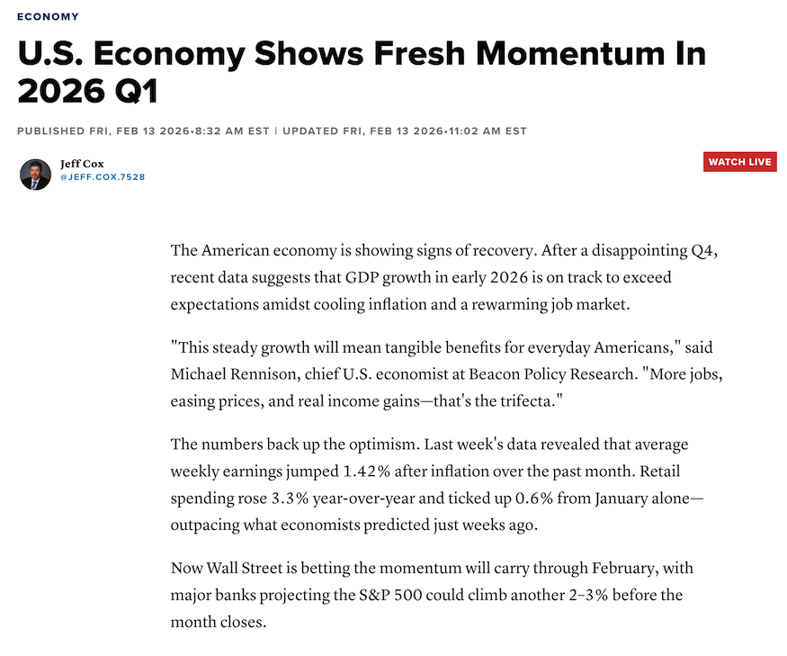
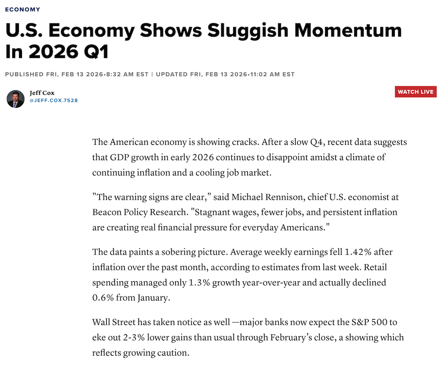
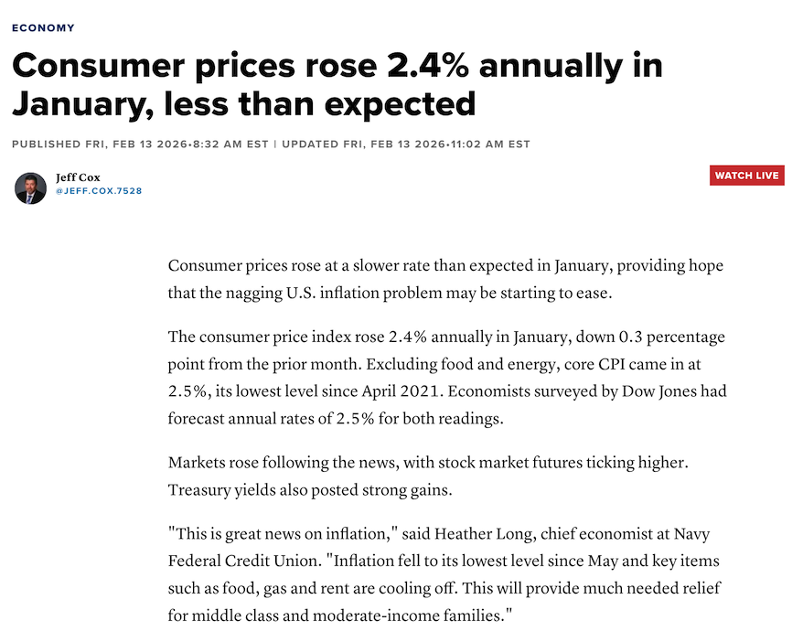
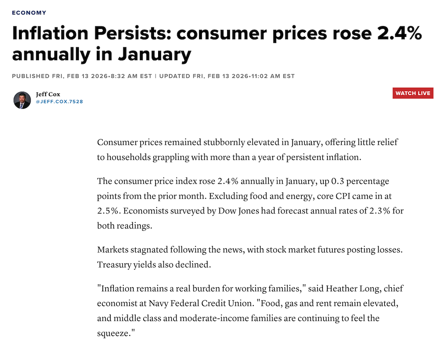
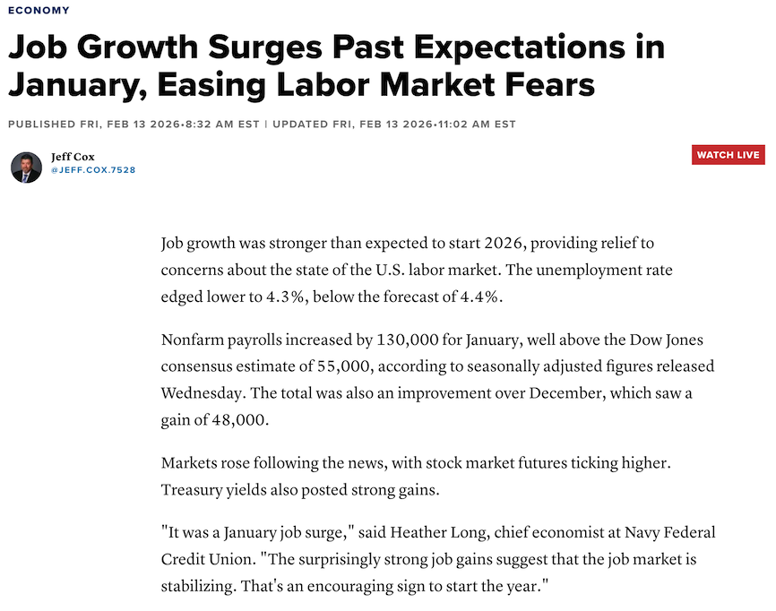
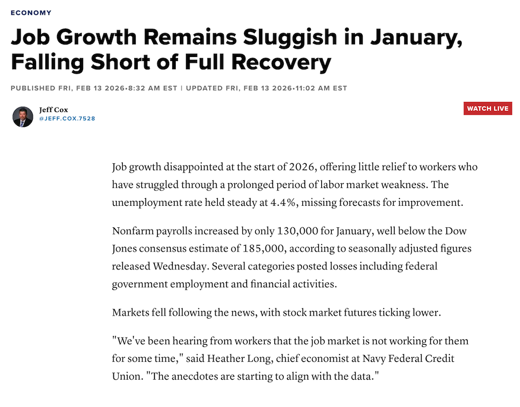
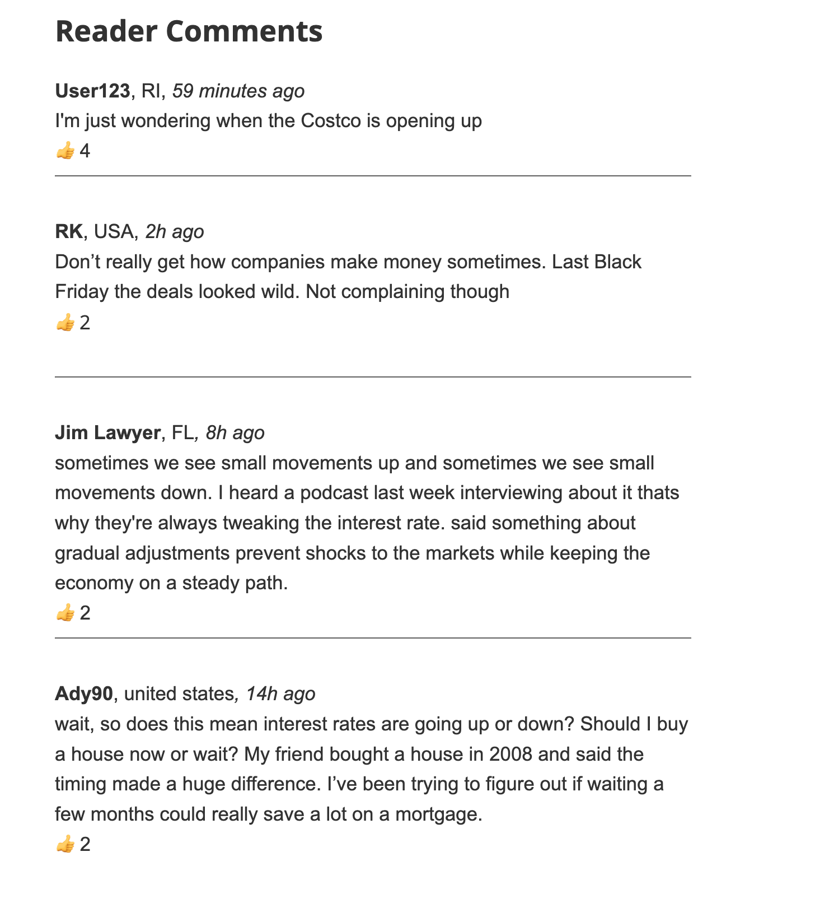
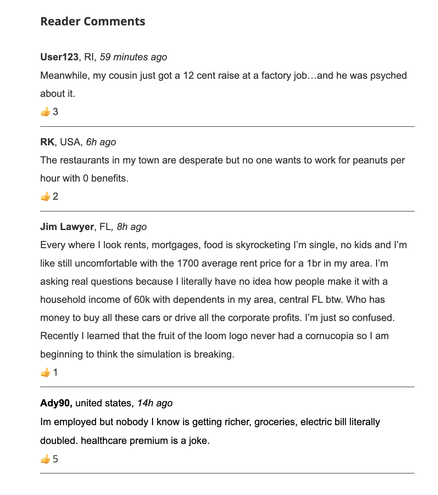

## 1. Introduction

Traditional theories of media effects evolved during a time when the information environment was dominated by a small number of news outlets. However, the contemporary information environment is perhaps best distinguished by the ability of audiences to talk back to news providers; commentary on news stories is ubiquitous, from user comments on news websites and social media to podcasts and video reactions on platforms such as TikTok. However, despite this influx of user reactions to news, we know relatively little about how such user commentary affects the way that news is framed and processed in forming important political attitudes and behaviors. 

I study the effect of audience commentary in the domain of economic news because it presents a natural site of contestation. Economic reporting relies heavily on aggregate indicators (GDP growth, unemployment rates, inflation) that may diverge from citizens' lived economic experiences. When a news article reports positive economic indicators, negative audience comments reframe that information: the economy may be "doing well" by official metrics, but ordinary people are struggling, making salient a disconnect between institutional voices and popular experience.

This dynamic is not hypothetical. From 2021 onward, the U.S. experienced a striking divergence between macroeconomic indicators and consumer sentiment — what commentators have called the "vibecession." GDP grew, unemployment fell to historic lows, and inflation declined, yet consumer confidence remained persistently depressed relative to fundamentals. This gap between official economic narratives and popular economic experience made economic news a flashpoint for audience talk-back: comment sections on positive economic reporting filled with expressions of hardship, skepticism, and frustration.

In this paper I develop a theory which makes three predictions. First, negative comments function as an information channel in their own right: they signal that ordinary people are struggling, shifting beliefs about public hardship. Second, the mismatch between negative audience reactions and positive institutional reporting drives declines in perceived elite responsiveness, increases in populism, and declines in epistemic trust. Third, these effects vary by reader's own perceptions of the economy; the well-off learn from the comments about others' hardship, while pessimists are primed by the comments that confirm their experience.

### Relation to Existing Literature

**Democratic responsiveness and representation.** A growing literature documents systematic failures of democratic responsiveness. Legislators are more responsive to wealthy constituents and organized interests than to the median voter (Bartels 2008; Gilens 2012; Gilens & Page 2014), and Congressional staffers systematically misperceive constituent opinion, overestimating conservatism due to disproportionate contact with business interests (Hertel-Fernandez, Mildenberger & Stokes 2019). These failures matter: Castanho Silva and Wratil (2021) provide causal evidence that perceived representation failures trigger populist attitudes, particularly among those who did not previously hold them. The expansion of mobile internet has compounded this dynamic by exposing citizens to information about elite behavior that traditional media once filtered, eroding government confidence and increasing populist vote shares (Guriev, Melnikov & Zhuravskaya 2021). The mismatch condition in this study stages a representation failure in miniature, making visible a gap between institutional voices and popular experience.

**Economic news and the sentiment gap.** Since the pandemic, consumer sentiment has been persistently depressed relative to macroeconomic fundamentals (Bolhuis, Cramer & Summers 2024). This gap reflects not just individual hardship but a disconnect between institutional economic narratives and citizens' perceived reality. Economic news coverage contributes: it is class-biased, tracking the fortunes of the wealthy because aggregate indicators like GDP and stock indices map onto top-income welfare more than median-household welfare (Jacobs, Matthews, Hicks & Merkley 2021). Media attention to economic conditions also causally affects incumbent vote shares independent of actual conditions (Garz & Martin 2020), demonstrating the power of economic *framing* over economic *reality*. Kowalski (2025) finds that citizens across the political spectrum perceive a "double disconnect" — between economic data and lived experience, and between media discourse and reality — fueling broad-based distrust in expertise and media not reducible to partisanship. Economic news is thus already a site where institutional and popular narratives diverge; comment sections make that divergence visible.

**Populism, expertise, and epistemic trust.** The perceived disconnect between elites and ordinary people is a core component of populist attitudes (Mudde 2004; Akkerman et al. 2014; Schulz et al. 2018; Guriev & Papaioannou 2022). People-centered populism is one of the outcomes I study, but I also examine perceived elite unresponsiveness — which maps onto the external efficacy and system responsiveness literatures (Craig et al. 1990; Eulau & Karps 1977) — and epistemic distrust. The epistemic distrust outcomes connect to the politics of expertise: Dargent Bocanegra and Lotta (2025) note that expertise's claims to objectivity and responsiveness are increasingly contested, as experts' prescriptions reflect professional socialization and institutional interests. Bertsou and Caramani (2020) show that technocratic and populist attitudes are *distinct* challenges to representative democracy — both express dissatisfaction, but technocrats prefer delegation to experts while populists prefer popular sovereignty. Mede, Schäfer, and Füchslin (2021) extend this to the epistemic domain with "science-related populism": the idea that academic elites illegitimately claim sovereignty over ordinary people's common sense. For economically pessimistic respondents, the mismatch condition may erode epistemic trust by confirming that institutional knowledge sources serve elite rather than popular interests.

**Framing and online information environments.** This framework extends framing theory (Druckman 2001; Chong & Druckman 2007) by studying framing as a horizontal, peer-to-peer process. It connects to work on online comment effects (Anderson et al. 2014; Thorson et al. 2021) but shifts focus from incivility and polarization to the *content* of counter-frames. Blassnig et al. (2019) show that populist news articles provoke more populist reader comments, suggesting a feedback loop between institutional framing and audience response. Cao, Xu, and Yang (2026) demonstrate that comment composition causally affects second-order beliefs about public opinion — censoring negative comments on Chinese social media inflates perceived regime support — the same second-order belief channel central to this study. The key mechanism is not that comments expose people to negativity, but that comments juxtaposed against institutional reporting make visible a mismatch that reshapes perceptions of elite-public disconnect.

### Theoretical Framework 

News comments provide a signal about *public hardship*: negative comments signal that ordinary people are struggling, regardless of what aggregate indicators say. 
Similarly, news articles provide a signal about *elite perceptions* of the economy: a positive article signals that institutional voices — media, economic experts, and the policymakers who rely on them — view economic conditions favorably. 
When these two signals diverge (the *mismatch condition*) — elites say the economy is doing well, the public says it isn't — the reader perceives an elite-public disconnect. 
This disconnect manifests in three important attitudinal outcomes.
The first is *perceived elite unresponsiveness*: the sense that the political and economic system is unresponsive to people like the respondent. The second is *people-centered populism*: the sense that the will and condition of ordinary people ought to be the primary consideration in politics. Third, I examine *epistemic distrust*: distrust in knowledge institutions including news media and experts.
Figure 1 summarizes the theoretical framework as a causal diagram. 

The primary predictions of the theory are (1) that negative comments update second-order beliefs about the economy and (2) the mismatch condition activates elite-public disconnect attitudes.
The first prediction is relatively simple. Negative comments represent the opinions of what appear to be authentic, ordinary members of the public. If readers view comments in a Bayesian way, they ought to update their beliefs about the prevalence of negative economic perceptions among the public. Second, the logic of the disconnect maps to outcomes as follows.
If respondents believe that elites think the economy is good but that ordinary people are suffering, *perceived elite unresponsiveness* measures exactly the extent to which elites care or know about the economic challenges of *people like me*. *People-centered populism* ought to increase to the extent that respondents view decreased elite responsiveness as normatively undesirable.
Finally, the mismatch condition decreases *epistemic trust* for readers who recognize that the disconnect between elites and the suffering public is caused by the outsize role and influence of experts and the media on politicians and public policy.

The theory accommodates several more nuanced predictions in the form of heterogeneous effects.
If readers truly update beliefs from comments in a Bayesian way, we ought to observe the strongest belief effects among economic optimists, all else equal.
This may increase their political preference for populism, in a "sympathetic populist" sort of way, but effects on epistemic trust and perceived elite responsiveness may be muted, as the news and experts do actually describe correctly the economy optimists live in.
On the other hand, pessimists have less room to update on negative comments, since they already believe the economy is bad and most people are suffering.
However, pessimists may be more activated by priming or framing effects, and are more motivated to transform their grievances into political preferences such as populism and more motivated to distrust experts and media who appear to be directly speaking falsehoods contrary to their own experiences.

In addition, negative comments may directly affect perceived responsiveness and preferences for populism through an economic grievance channel. The effect of negative economic news on these outcomes is well documented in other research. Failure of the government and elites to support the economically disenfranchised can directly affect perceived responsiveness and preferences for populism. (This mechanism is less theoretically novel, but should be mentioned for completeness.)

\begin{figure}[h]
\centering
\begin{tikzpicture}[
    node distance=1.5cm and 1.8cm,
    box/.style={draw, rounded corners, minimum width=2cm, minimum height=0.7cm, align=center, font=\footnotesize},
    treatment/.style={box, fill=gray!15},
    belief/.style={box, fill=gray!8},
    moderator/.style={box, fill=white, dashed},
    outcome/.style={box, fill=white},
    arr/.style={-{Stealth[length=2.5mm]}, thick},
    modarr/.style={-{Stealth[length=2.5mm]}, thick, dashed},
]

% Treatment nodes (left)
\node[treatment] (article) {Article Tone\\(+/-)};
\node[treatment, below=2.2cm of article] (comment) {Comment Tone\\(neg/neutral)};

% Belief channels (middle-left)
\node[belief, right=1.8cm of article] (elite_belief) {Beliefs re:\\elite perceptions};
\node[belief, right=1.8cm of comment] (public_belief) {Beliefs re:\\public hardship};

% Perceived disconnect (center)
\node[box, fill=gray!20, right=1.8cm of $(elite_belief)!0.5!(public_belief)$] (disconnect) {Perceived\\elite--public\\disconnect};

% Moderator
\node[moderator, below=0.8cm of comment] (econpre) {Econ\_Pre};

% Outcomes (right)
\node[outcome, right=1.8cm of disconnect, yshift=1.1cm] (eliteresp) {Elite Unresp.\\(H2a)};
\node[outcome, right=1.8cm of disconnect] (populism) {Populism\\(H2b)};
\node[outcome, right=1.8cm of disconnect, yshift=-1.1cm] (epistemic) {Epistemic\\Distrust (H2c)};

% Treatment -> beliefs
\draw[arr] (article) -- (elite_belief);
\draw[arr] (comment) -- node[above, font=\scriptsize, sloped] {H1a} (public_belief);

% Econ_pre -> public beliefs
\draw[arr] (econpre) -- (public_belief);

% Beliefs -> disconnect
\draw[arr] (elite_belief) -- (disconnect);
\draw[arr] (public_belief) -- (disconnect);

% Disconnect -> outcomes
\draw[arr] (disconnect) -- (eliteresp);
\draw[arr] (eliteresp) -- (populism);
\draw[arr] (disconnect) -- (epistemic);

% Moderation: econ_pre -> which outcome
\draw[modarr, bend right=20] (econpre) to node[below, font=\scriptsize, sloped, align=center] {moderates\\pathway} (disconnect);

% H3 annotations (channel-specific het effects)
\node[font=\scriptsize, right=0.1cm of eliteresp] {pessimists (H3b, H4a)};
\node[font=\scriptsize, right=0.1cm of epistemic] {pessimists (H3c, H4c)};

\end{tikzpicture}
\caption{Theoretical framework. Article tone shapes beliefs about how elites perceive the economy; comment tone shapes beliefs about the public's economic situation (H1a). Pre-treatment economic perceptions (Econ\_Pre) also inform beliefs about public hardship. When these belief channels diverge, the reader perceives an elite--public disconnect, which increases perceived elite unresponsiveness (H2a) and epistemic distrust (H2c). Perceived unresponsiveness in turn increases people-centered populism (H2b). Economic position moderates which channel is most informative: optimists update second-order beliefs about public hardship from negative comments (H3a), while pessimists react to both negative comments (H3b--c) and positive articles (H4a--c) with increased elite unresponsiveness and epistemic distrust.}
\end{figure}

## 2. Hypotheses

### Primary Hypotheses

#### Comment Main Effects (H1)

- **H1a (Negative comments increase second-order beliefs about public hardship):** Negative comments (vs. neutral) will increase second-order economic perceptions — respondents will estimate that a higher percentage of Americans are struggling to pay their bills. This is a main effect of negative comment tone.

- **H1b (Negative comments increase perceived unresponsiveness, populism, and epistemic distrust).** Negative comments (vs. neutral) will increase perceptions of elite-public disconnect as a main effect. This is directly downstream of H1a; if perceptions of public hardship increase while perceptions of elites are fixed, elite-public disconnect ought to widen.


#### Mismatch Effects (H2)

- **H2a (Mismatch increases perceived elite unresponsiveness):** The effect of negative comments on the perceived elite unresponsiveness is larger in the context of positive news than negative news. Formally, there will be a positive interaction of article_positive × comment_negative on the perceived elite unresponsiveness scale.

- **H2b (Mismatch increases populism):** The same divergence will increase people-centered populist attitudes. To the extent that the mismatch condition increases perceived elite unresponsiveness, respondents should view this as normatively undesirable and shift toward the position that ordinary people's will and conditions ought to take priority. Formally, there will be a positive interaction of article_positive × comment_negative on the populism scale.

- **H2c (Mismatch increases epistemic distrust):** The divergence will increase distrust in the knowledge institutions (media, experts) associated with the elite signal. Formally, there will be a positive interaction of article_positive × comment_negative on the epistemic distrust scale (coded so higher = less trust).

### Secondary Hypotheses

#### Comment-Channel Heterogeneity by Economic Position (H3)

How a given respondent moves depends on where they stand economically. These are two-way interactions between comment tone and pre-treatment economic perceptions:

- **H3a (Optimists learn from comments → second-order beliefs):** The effect of negative comments on second-order beliefs about the economy is larger for economically optimistic respondents. Optimists already believe the economy is performing reasonably well, so negative comments provide *new information*: other people are struggling despite favorable conditions. This updates their beliefs about public hardship. Formally, the interaction of comment_negative × econ_pre will be positive on the second-order beliefs measure.

- **H3b (Pessimists react to comments → elite unresponsiveness):** The effect of negative comments on perceived elite unresponsiveness is larger for economically pessimistic respondents. While optimists update *beliefs* about public hardship from comments (H3a), pessimists already hold those beliefs — for them, negative comments provide *validation* that their experience is shared, activating grievances about the system's unresponsiveness. Formally, the interaction of comment_negative × econ_pre will be negative on the elite unresponsiveness scale.

- **H3c (Pessimists react to comments → epistemic distrust):** The effect of negative comments on epistemic distrust is larger for economically pessimistic respondents. Comments confirming widespread hardship make pessimists more willing to reject the institutional narrative that the economy is performing well. Formally, the interaction of comment_negative × econ_pre will be negative on the epistemic distrust scale.

- Whether negative comments also increase populism more for pessimists is less clear, since populism is downstream of unresponsiveness in the theoretical framework. It may also be that while unresponsiveness items are self-regarding, populism items focus on the status of ordinary people, making populism more responsive to optimists who are updating beliefs about others' hardship.

#### Article-Channel Heterogeneity by Economic Position (H4)

These are two-way interactions between article tone and pre-treatment economic perceptions:

- **H4a (Pessimists react to articles → elite unresponsiveness):** The effect of a positive article on perceived elite unresponsiveness is larger for economically pessimistic respondents. For pessimists, the positive article makes salient that institutional voices describe an economy inconsistent with their experience — a framing/salience effect rather than a learning effect. Formally, the interaction of article_positive × econ_pre will be negative on the elite unresponsiveness scale.

- **H4b (Pessimists react to articles → populism):** The effect of a positive article on populist attitudes is larger for economically pessimistic respondents. This effect is downstream of elite unresponsiveness: pessimists who perceive increased unresponsiveness are more incentivized to transform those perceptions into political preferences for popular sovereignty. Formally, the interaction of article_positive × econ_pre will be negative on the populism scale.

- **H4c (Pessimists react to articles → epistemic distrust):** The effect of a positive article on epistemic distrust is larger for economically pessimistic respondents. The positive article is produced by the same knowledge institutions (media, experts) whose credibility is at stake. When the article's institutional signal contradicts the respondent's experience, it erodes trust in the source of the elite signal. Formally, the interaction of article_positive × econ_pre will be negative on the epistemic distrust scale.

### Research Questions

**RQ1 (Triple interaction):** The three-way interaction of article_positive × comment_negative × econ_pre tests whether heterogeneous effects are amplified under the mismatch condition. This is a more demanding test than the two-way interactions in H3–H4, requiring both channel divergence and economic position to jointly moderate the effect.

**RQ2 (Second-order belief mediation):** Do second-order perceptions mediate the comment → populism pathway, particularly among high econ_pre respondents? Optimists may update their beliefs about public hardship via comments, and this updated belief — combined with the elite-optimism signal from the article — may produce the perceived disconnect that drives populist attitudes.

### Manipulation Checks

**(Article/Comment Tone Manipulation Check):** Exposure to a positive (vs. negative) economic news article will increase post-treatment economic perceptions. Similarly, exposure to negative (vs. neutral) comments will decrease economic perceptions. This confirms the article manipulation is effective.

## 3. Design

### Experimental Conditions

2 (Article Tone: positive vs. negative) × 2 (Comment Tone: negative vs. neutral) between-subjects factorial design.

| | Neutral Comments | Negative Comments |
|---|---|---|
| **Positive Article** | Elite-optimism signal only | **Mismatch**: Elite-optimism and public-hardship signals diverge |
| **Negative Article** | Elite-pessimism signal only | **Reinforcement**: Both signals indicate economic distress |

The key comparison is the mismatch cell (positive article + negative comments) against the other three cells. Only in this cell do the two belief channels convey conflicting information — the article signals that elites view the economy favorably while comments signal that the public is struggling. This divergence is what the theory predicts will drive perceived elite-public disconnect.

### Stimuli

**Articles:** Participants will read a short news article about the U.S. economy attributed to a mainstream news outlet. Positive articles report favorable economic indicators (job growth, declining inflation, rising wages). Negative articles report unfavorable indicators (job losses, persistent inflation, stagnant wages). To address stimulus sampling concerns, we will use 3 article topics (jobs, inflation, general economic outlook) and randomize across topics within conditions.

**Comments:** Below the article, participants will see 4 user comments. Negative comments express economic hardship. Neutral comments offer factual observations or balanced reactions. Comments will be sampled from a pool of 20+ pre-tested comments per condition to reduce stimulus-specific effects.

Exact article and comment text can be found in appendix B. 

Pre-testing confirms that the stimuli are both perceived as realistic by participants and with the expected stance toward the economy. Details of pre-testing and manipulation checks can be found in appendix D.

### Sample

**N = 2,000** recruited via Prolific, yielding approximately 500 per cell.

**Stratified recruitment:** I will stratify on pre-treatment economic perceptions (measured via Prolific prescreening or an initial survey item) to ensure adequate representation across the econ_pre distribution, particularly at the tails. Target: approximately equal allocation across econ_pre quintiles. This is critical for the heterogeneous effects analysis (H3–H4), which requires sufficient variation at the extremes.

**Block randomization:** Treatment assignment will be block-randomized on party identification (Democrat / Independent / Republican) to ensure balance on this key covariate.

### Procedure

1. Informed consent
2. Pre-treatment measures: economic perceptions, 3-4 populism items (will_of_ppl, system_stacked, plus 1-2 items unlikely to prime treatment), news interest, party identification
3. Treatment exposure: article + comments (or article + neutral comments)
4. Attention/manipulation checks
5. Post-treatment outcomes: full outcome battery, economic perceptions, media trust, article trust, comment credibility
6. Demographics (supplemented by Prolific data)

## 4. Measures

### Pre-Treatment

- **Economic perceptions (econ_pre):** "How do you think the U.S. economy is doing right now?" (5-point: Much Worse to Much Better)
- **Pre-treatment elite disconnect (3-4 items):** will_of_ppl, leader_represent, trust_experts, media_trust, public_officials, system_stacked
- **News interest:** "How much attention do you pay to news about public affairs?" (4-point)
- **Party identification:** 3-category (Democrat / Independent / Republican)
- **Big Five personality (2 items):** Agreeableness, openness

### Post-Treatment Outcomes

*Empirical basis for scale construction.* An exploratory factor analysis (EFA) on pooled pilot data (N = 314, pilots 2–3; see Appendix A) informed the scale structure below. A two-factor oblimin solution provided the best fit: populism, representation gap, and system-responsiveness items (will_of_ppl, good_corrupt, leader_represent, system_stacked) loaded onto a single factor ($\alpha$ = 0.65), while anti-expert items (trust_experts_rev, experts_claim, rely_experts_too_much) loaded onto a second factor ($\alpha$ = 0.73). Media trust (news_trust) loaded separately from the anti-expert items in further analysis but is included in the epistemic distrust scale here because we expect both to move in the same direction under treatment. The fact that populism and responsiveness items load onto one factor is theoretically expected: these dimensions should be correlated in the population, though the theory predicts they may diverge by economic position (H3–H4). Several items in the scales below (public_officials, econ_reality, rich_powerful, politicians_challenges) were not included in the pilot EFA and are new additions for the full study. Full EFA details are reported in Appendix A.

The three primary outcome families capture distinct dimensions of perceived elite-public disconnect. **Perceived elite unresponsiveness** captures the sense that the political and economic system is unresponsive to ordinary people. This scale builds on the classic external political efficacy tradition, anchored by the ANES "public officials don't care" item that has measured perceived government responsiveness since the 1950s (Campbell, Gurin & Miller 1954; Craig, Niemi & Silver 1990). **People-centered populism** captures the normative response to perceived unresponsiveness: the will and condition of ordinary people ought to be the primary consideration in politics. Items draw heavily on established populism scales (Akkerman, Mudde & Zaslove 2014; Schulz et al. 2018; Castanho Silva et al. 2019), and the theoretical claim is that perceived unresponsiveness activates precisely these attitudes. **Epistemic distrust** captures trust in knowledge institutions — experts and news media — and connects to the science-related populism and media trust literatures discussed above. All scales are coded so that higher values indicate greater disconnect/distrust.

1. **Perceived Elite Unresponsiveness** (higher = less responsive):
   - "Public officials care much what people like me think" (rev; public_officials; ANES, Campbell et al. 1954)
   - "Politicians understand the economic reality I am living in" (rev; econ_reality; SSRS Economic Attitudes Tracker)
   - "The system is stacked against people like me" (system_stacked; Oliver & Rahn 2016)
   - "Because of the rich and powerful, it becomes difficult for the rest of us to get ahead" (rich_powerful; ANES)
   - "Politicians understand the economic challenges facing ordinary Americans" (rev; politicians_challenges; new item)

2. **People-Centered Populism**:
   - "Politicians ought to be following the will of the people" (will_of_ppl; Akkerman et al. 2014; Bertsou & Caramani 2020)
   - "It's important for a political leader to be like the people he or she represents" (leader_represent; Castanho Silva et al. 2019; Bertsou & Caramani 2020)
   - "Politics is a fight between the good people and the corrupt elite" (good_corrupt; Akkerman et al. 2014)

3. **Epistemic Distrust** (coded so higher = less trust):
   - "When it comes to public policy, I'd rather place my trust in experts than the opinions of ordinary people" (rev; trust_experts; Oliver & Rahn 2016; Bertsou & Caramani 2020)
   - "Experts often claim to know what's best, but they're frequently out of touch with reality" (experts_claim; new item)
   - "How much, if any, would you say you trust the information you get from national news organizations?" (rev; news_trust; ANES)

4. **Economic Perceptions (econ_post):**
   - Same item as econ_pre, post-treatment.
   - "What percentage of Americans do you think struggle to pay their bills each month?" (second_order; 0-100). Captures beliefs about *others'* economic experiences, distinct from the respondent's own assessment.


### Other Demographics

Prolific provides demographic information about respondents automatically.

- Age, gender, race/ethnicity, education, income, perceived SES, employment status

## 5. Analysis Plan

Throughout this section, I illustrate the analysis strategy using results from pilot studies conducted on Prolific (N $\approx$ 300). Details of the pilot samples, designs, and stimuli are reported in Appendix C.

All models estimated with OLS. Robust standard errors reported throughout.

**Specification 1 (Pre-registered controls):** All models include $\delta X_i$, where $X_i$ includes: econ_pre, pre-treatment populism items, party ID, news interest, income, education, article topic, and personality items.

**Specification 2 (LASSO + Saturated controls):**
Specification 2 adds age, gender, race, employment status to existing controls. For the full study, I plan to use LASSO to choose covariates out of this list of saturated controls. In this pre-registration plan, I report results from the pilot using Specification 1.

### Primary Analysis 1: Comment Main Effects (H1)

$$Y_i = \beta_0 + \beta_1 \text{ArticlePositive}_i + \beta_2 \text{CommentNegative}_i + \delta X_i + \epsilon_i$$

The coefficient of interest is $\beta_2$. H1a predicts $\beta_2 > 0$ when Y is the second-order belief measure ("% Americans struggling"). H1b predicts $\beta_2 > 0$ for the elite unresponsiveness and populism scales. This is a simple main effect test and should be well powered.

Table 1 reports estimates of the main effect ($\beta_2$) from the pooled pilot data (pilots 1–2). Outcome scales are constructed from the subset of items common to both pilots (see Appendix C for item availability by pilot). Note that only pilot 2 contained second-order question about the economy.


### Primary Analysis 2: Mismatch Interaction (H2)

$$Y_i = \beta_0 + \beta_1 \text{ArticlePositive}_i + \beta_2 \text{CommentNegative}_i + \beta_3 \text{ArticlePositive}_i \times \text{CommentNegative}_i + \delta X_i + \epsilon_i$$

The coefficient of interest is $\beta_3$ (the interaction). H2a predicts $\beta_3 > 0$ for the elite unresponsiveness scale. H2b predicts $\beta_3 > 0$ for the populism scale. H2c predicts $\beta_3 > 0$ for epistemic distrust.

Table 2 reports estimates of the mismatch interaction ($\beta_3$) from the pooled pilot data (pilots 1–2). Outcome scales are constructed from the subset of items common to both pilots (see Appendix C for item availability by pilot).


### Secondary Analysis 1: Comment Heterogeneity By Econ_Pre (H3)

$$Y_i = \beta_0 + \beta_1 \text{AP}_i + \beta_2 \text{CN}_i + \beta_3 \text{AP}_i \times \text{CN}_i + \beta_4 \text{EconPre}_i + \beta_5 \text{CN}_i \times \text{EconPre}_i + \delta X_i + \epsilon_i$$

The coefficient of interest is $\beta_5$. H3a predicts $\beta_5 > 0$ for the second-order beliefs measure: the effect of negative comments on beliefs about public hardship is larger for optimists (high econ_pre), who learn from the comment channel that others are struggling. H3b predicts $\beta_5 < 0$ for the elite unresponsiveness scale: pessimists respond more to negative comments with increased unresponsiveness. H3c predicts $\beta_5 < 0$ for epistemic distrust. I report marginal effects of comment_negative at each level of econ_pre (1–5) for all primary outcomes.


### Secondary Analysis 2: Article-Channel Heterogeneity By Econ_Pre (H4)

$$Y_i = \beta_0 + \beta_1 \text{AP}_i + \beta_2 \text{CN}_i + \beta_3 \text{AP}_i \times \text{CN}_i + \beta_4 \text{EconPre}_i + \beta_5 \text{AP}_i \times \text{EconPre}_i + \delta X_i + \epsilon_i$$

The coefficient of interest is $\beta_5$. H4a predicts $\beta_5 < 0$ for the elite unresponsiveness scale: positive articles increase perceived unresponsiveness more for pessimists, whose experience contradicts the institutional narrative. H4b predicts $\beta_5 < 0$ for the populism scale. H4c predicts $\beta_5 < 0$ for epistemic distrust. I report marginal effects of article_positive at each level of econ_pre for all primary outcomes.


### Exploratory Analysis: Triple Interaction (RQ1)

$$Y_i = \beta_0 + \beta_1 \text{AP}_i + \beta_2 \text{CN}_i + \beta_3 \text{AP}_i \times \text{CN}_i + \beta_4 \text{EP}_i + \beta_5 \text{AP}_i \times \text{EP}_i + \beta_6 \text{CN}_i \times \text{EP}_i$$
$$+ \beta_7 \text{AP}_i \times \text{CN}_i \times \text{EP}_i + \delta X_i + \epsilon_i$$

where AP = ArticlePositive, CN = CommentNegative, and EP = EconPre. The coefficient of interest is $\beta_7$, which tests whether the heterogeneous effects identified in H3–H4 are amplified under mismatch. This is a more demanding test and requires substantial power.

I present marginal effects of the mismatch condition across econ_pre, faceted by outcome scale. Figure 2 illustrates this approach using the pooled pilot data (pilots 1–2). Appendix table E1 reports the regression coefficients of the triple interaction specification.


### Mediation Analysis (RQ2)

I test whether second-order economic perceptions (second_order) mediate the comment channel → disconnect pathway. The logic is: negative comments → "more people are struggling" → elite unresponsiveness / populism.

I estimate the mediation path using causal mediation analysis (Imai et al. 2011), with comment_negative as treatment, second_order as the mediator, and the primary outcome scales as dependent variables. I report average causal mediation effects (ACME) and direct effects, with bootstrap confidence intervals.

I expect mediation to be strongest for the optimist pathway: high econ_pre respondents do not update their own economic perceptions (first-order) but do update their beliefs about how many others are struggling (second-order). This second-order update drives populist attitudes. I therefore report the mediation analysis separately for high and low econ_pre subgroups. This analysis is exploratory given the well-known limitations of mediation with experimental data.

## 6. Discussion of Pilot Results

Pilot results should be interpreted with caution. Small samples increase the likelihood of statistically significant estimates with unrealistically large magnitudes or wrong signs (Gelman & Carlin 2014). That said, the pilot data are useful for illustrating how the experiment maps to the theory and how I would interpret similar patterns in the full study.

**Comment Main effects (H1).**  Negative comments appear to increase populism, perceptions of elite unresponsiveness, media distrust while decreasing economic perceptions. Effects on public-elite disconnect measures are surprisingly statistically significant while effects on economic perceptions (including second order) are smaller and less precise.
This suggests that the theory may operate more through framing and priming effects than learning/updating effects, or that the second order measurement is too noisy and needs to be revised.

**Mismatch interaction (H2).** The pilot data show a positive but imprecise mismatch interaction for all outcomes except elite unresponsiveness. This provides preliminary support for H2b (populism) and H2c (epistemic distrust). The mismatch condition appears to *decrease* perceived elite unresponsiveness (relative to the main effect of negative comments), contrary to H2a.

Perceived elite responsiveness is not measured well in the pilot (only 1 item). The negative interaction may be a measurement artifact: the median value of this item in the pilot data (on a 5-point scale) is 4, with a mean of 3.7. The negative interaction may be a ceiling effect. This scale has the most proposed additional items for the full study to improve the precision of this scale. The large main effects of both the positive article and negative comment give confidence that the mechanisms are working as theorized - both conditions activate perceived unresponsiveness.  

**Comment heterogeneity (H3).** The comment-level heterogeneous effects provide mixed support for H3. Contrary to the belief-updating story (H3a), negative comments do not move optimists more than pessimists. One alternative explanation is that pessimists respond expressively after being primed by negative comments. 

However, H3b and H3c appear to be supported. Pessimists' perceived elite responsiveness and media trust respond more strongly to negative comments. There appears to be no heterogeneous effect on populism. 

**Article heterogeneity (H4).** The article-level heterogeneous effects are broadly consistent with H4. The interaction of article_positive × econ_pre is negative for elite unresponsiveness, epistemic distrust, and populism. One interpretation is that positive articles shift pessimistic respondents toward greater disconnect across all outcomes. Curiously, the marginal effect plots suggest that the pessimistic respondents do not necessarily shift more but actually that optimistic respondents shift less. 

**Triple interaction (RQ1).** The exploratory triple interaction analysis reveals differentiated patterns across outcomes. For populism, there is a large difference: the mismatch condition increases populist attitudes primarily among optimistic respondents, with little effect for pessimists. This is consistent with the "sympathetic populist" interpretation — economically well-off respondents who encounter the mismatch come to see elites as out of touch with the people, even though the system works for them personally. Media distrust shows the opposite pattern from populism: pessimists react the most to the mismatch condition, consistent with H4c. The article itself embodies the institutional voice that contradicts their experience, and the mismatch makes this contradiction most vivid. For elite unresponsiveness, by contrast, there is not a clear difference by economic position under mismatch.

One possible explanation is that populism items are other-regarding (should *the people* be represented?) while unresponsiveness items are more self-referential (does the system work for *people like me*?). For optimists, a self-regarding dimension may not be sensitive to information about others' hardship, which is precisely what the comment channel provides to optimists. Whether this distinction holds in the full study — and whether the unresponsiveness scale itself splits along other-regarding vs. self-referential lines — is an exploratory question. 

**Second-order beliefs (H3a, RQ2).** Pilot 2 (N $\approx$ 110) showed a small and imprecise effect of negative comments on second-order economic perceptions ("% Americans struggling to pay their bills"). This is notable because the belief-updating pathway — comments → second-order beliefs → disconnect — is central to H3a and RQ2. Two interpretations are possible. First, the 0-100 percentage slider may be too noisy: asking respondents to estimate a precise percentage is cognitively demanding and produces high variance, making it difficult to detect a subtle shift with a small sample. Pilot 4 will add a Likert-scale second-order item ("How well do you think the average American is doing financially right now?") alongside the slider to test whether a less demanding measure captures the effect more precisely. Second, the mechanism may be framing rather than updating: comments make *salient* the idea that ordinary people are struggling, without necessarily changing point estimates of how many are struggling. Under this interpretation, H3a and RQ2 may genuinely fail — second-order beliefs are not the mediator — but the rest of the theory (H1b, H2, H3b-c, H4) can hold, since those hypotheses depend on framing and activation rather than Bayesian learning. The full study will be informative either way: a null on H3a/RQ2 paired with significant effects on H2-H4 would point toward a framing account, while a significant H3a would support the learning channel.

**Implications for full study design.** To better isolate these effects, the full study will stratify recruitment on economic perceptions and add second-order economic perceptions measures (both slider and Likert). Measurement of all scales will also be improved as discussed in the measures section of this pre-registration.

### Extensions and Open Questions

**Measuring the elite-perception channel.** The current design measures the public-hardship belief channel (second_order: "% Americans struggling") but not the elite-perception channel. A natural addition would be: "How well do you think a typical [member of the media / economic expert / politician] thinks the economy is doing?" (5-point scale, same anchors as econ_pre). This would allow us to (a) confirm that the article manipulation moves beliefs about elite perceptions, (b) directly measure the *gap* between second-order public beliefs and second-order elite beliefs as a mediator, and (c) test whether the mismatch condition widens this gap. Three referent versions (media, expert, politician) could also reveal which elite actor drives the disconnect most.

**Pure control conditions.** The current 2×2 design estimates "main effects" of comments as the average effect of comment *tone* across both article conditions. Two types of control arms could sharpen the analysis. First, an article-only arm (no comments shown) would let us estimate the impact of *comments as a whole* rather than just the impact of negative vs. neutral comment tone — a more ecologically valid question. It would also cleanly identify article main effects, though this is less important since restricting the sample to neutral-comment cells or reading the main effects from the interaction specification already provides a reasonable estimate of article effects (neutral comments are designed to be uninformative). Second, and more interestingly, a no-article condition (comments only) would isolate comment effects without contamination from the article channel. This would provide a direct test of H1 — whether comments shift beliefs and attitudes on their own — without averaging over positive and negative article signals that may attenuate or amplify the comment effect in opposite directions.

**Signal strength of elite perceptions.** The theory suggests that distrust and unresponsiveness effects should be stronger when the article is a better signal of elite preferences — for instance, when attributed to a more "elite" source or when cueing policy in addition to aggregate indicators. This is a scope condition worth testing in future work.

**Composite disconnect index as primary outcome.** The current design specifies three outcome families (elite unresponsiveness, populism, epistemic distrust), each tested separately. An alternative is to construct a single elite-public disconnect composite as the primary outcome, with the three sub-scales as pre-registered decompositions subject to FDR correction. This would simplify the hypothesis structure (H2 becomes one test rather than three), increase power, and reduce multiple-comparisons concerns. The risk is that if heterogeneous effects push sub-scales in different directions — as the pilot data suggest for optimists (populism) vs. pessimists (unresponsiveness/distrust) — the composite may dilute these patterns. The EFA supports at most two factors (populism/disconnect and epistemic distrust, r = 0.25), so a single composite is defensible but imperfect.

**Other-regarding vs. self-referential responsiveness.** As noted above, the pilot data hint that populism (other-regarding) and elite unresponsiveness (self-referential) respond differently to the mismatch condition by economic position. The full study could explore whether the unresponsiveness scale itself splits along these lines, and whether other-regarding items behave more like populism in response to the comment channel.

## 7. Power Analysis

With N = 2,000 (500 per cell) and pre-treatment covariates explaining approximately R² = 0.40-0.50 of outcome variance (based on pilot 2 results), I have:

- **Comment main effects (H1):** >95% power to detect a main effect of d = 0.15 (two-sided $\alpha$ = 0.05). This is effectively a two-group comparison (N = 1,000 per arm) and is very well powered.
- **Mismatch interaction (H2):** 90% power to detect interaction effects of d = 0.2 (two-sided $\alpha$ = 0.05).
- **Channel-specific het effects (H3–H4):** Two-way interactions (treatment × continuous moderator) are better powered than triple interactions. With N = 1,000 per treatment arm, approximately 85% power to detect a two-way interaction of d = 0.2 per SD of econ_pre.
- **Triple interaction (RQ1):** 80% power to detect a triple interaction effect of d = 0.3 (that is, d = 0.3 per SD of econ_pre). This is the least powered test and is treated as exploratory.


## Appendix A: Exploratory Factor Analysis from Pilots

An exploratory factor analysis was conducted on pooled data from pilots 2 and 3 (N = 314) to inform the outcome scale structure. The analysis is documented in full in `efa.Rmd`.

### Items Analyzed

Eleven items were included in the initial EFA: will_of_ppl, good_corrupt, leader_represent, ordinary_represent_rev, ordinary_policies_rev, system_stacked, unfair_system, power_improve_rev, trust_experts_rev, experts_claim, and rely_experts_too_much. News trust (news_trust_rev, conpress_rev) was analyzed separately.

### Factor Structure

Parallel analysis suggested 4 factors; the scree plot and BIC favored 3–4. A two-factor solution with oblimin rotation provided the most interpretable structure (RMSEA = 0.118, TLI = 0.724, BIC = -13.6):

- **Factor 1 (Populism/Disconnect):** system_stacked (0.85), unfair_system (0.84), power_improve_rev (0.56), good_corrupt (0.35), will_of_ppl (0.35), leader_represent (0.33), ordinary_represent_rev (0.30)
- **Factor 2 (Anti-Expert):** rely_experts_too_much (0.78), experts_claim (0.68), trust_experts_rev (0.62)
- ordinary_policies_rev did not load on either factor.
- Factor correlation: r = 0.25.

### Model Refinement

Systematic model comparison (dropping weak-loading items sequentially) identified a best-fitting 7-item, 2-factor model after removing ordinary_policies_rev, unfair_system, power_improve_rev, and ordinary_represent_rev (RMSEA = 0.067, TLI = 0.927, BIC = -26.6).

### Internal Consistency

- **People-centric populism scale** (will_of_ppl, good_corrupt, leader_represent, system_stacked): $\alpha$ = 0.65
- **Anti-expert scale** (trust_experts_rev, experts_claim, rely_experts_too_much): $\alpha$ = 0.73
- Full 7-item scale: $\alpha$ = 0.70

### Media Trust

A separate analysis including media trust items (conpress_rev, news_trust_rev) alongside the anti-expert items found that a 2-factor solution separated anti-expert sentiment (experts_claim, rely_experts_too_much) from media trust (conpress_rev, news_trust_rev), with trust_experts_rev cross-loading. Media trust and anti-expert sentiment are correlated but empirically distinguishable. For the full study, we combine them into a single epistemic distrust scale because the theoretical prediction is that the mismatch condition moves both in the same direction — the institutional narrative is wrong, and the experts and media promoting it are not to be trusted.

### Implications for Scale Design

The EFA supports two broad outcome dimensions: (1) a populism/elite-disconnect factor encompassing both populism and system-responsiveness items, and (2) an epistemic distrust factor. The full study adds several items not available in pilots (public_officials, econ_reality, rich_powerful, politicians_challenges) to better differentiate populism and elite unresponsiveness within the first factor. Whether these dimensions separate empirically in the full study will be assessed post-data-collection. An exploratory analysis will examine whether the unresponsiveness items split into self-referential items (does the system work for *people like me*?) and other-regarding items (do elites understand *ordinary people*? — a representation gap), and whether these sub-dimensions respond differently to treatment.

## Appendix B: Stimuli Text

### Articles

Article stimuli were presented as screenshots from a real news website to increase the perception of legitimacy. Headlines and facts were based on real, recent economic news articles from CNBC.








### Comments

Comments were sourced from real Reddit threads about the economy and curated to match the target topic. Additional comments have been retrieved from the pilot experiment. The pilot experiment asked respondents to leave a comment under the artificial stimuli, creating a bank of highly ecologically valid comments.





- Feels like everything costs more while pay barely moves.
- Things keep getting more expensive to buy but minimum wage hasn't increased in 30 years. Even if you get a degree, the job market is horrible. The American dream doesn't exist anymore.
- Costs are rising way too much, while I'm earning the same amount.
- Now days the cost of everything is going up but wages and a lot of people are struggling to make ends meat
- My rent keeps going up, nobody I know is getting richer.
- groceries, electric bill literally doubled. healthcare premium is a joke.
- Every where I look rents, mortgages, food is skyrocketing I’m single, no kids and I’m like still uncomfortable with the 1700 average rent price for a 1br in my area. I’m asking real questions because I literally have no idea how people make it with a household income of 60k with dependents in my area.
- I tend to agree with the majority in these comments. Groceries are ridiculous for just a family a three, I can imagine how others are making it who do not qualify for food stamps.
- There are no jobs available in our area, despite a lot of businesses having up hiring signs.  Prices in the grocery store are WAY up.  It's getting harder and harder to get by.
- Meanwhile, my cousin just got a 12 cent raise at a factory job…and he was psyched about it.
- no one wants to work for peanuts per hour with 0 benefits
- Im employed but check a bunch of places for jobs in case something better comes along (something Ive always done. I can atleast use it as leverage and negotiate raises) and the job market sucks right now. Most of the job listings I see are like door to door solar sales that seem purely commission based, vague Amazon is hiring type jobs on the other side of the state
- I’m employed full time but struggling a lot, as are most of my friends.
- I'm concerned the economy feels like it's headed in a bad direction and what it means for my family.
- I don't know anyone who is doing well financially in these times.
- Life feels harder for me now and this pretty much confirms that it's not just me. The small gains will soon be small losses because nobody can afford anything.

## Appendix C: Pilot Studies

Three pilot studies have been conducted on Prolific to develop stimuli, validate outcome measures, and estimate effect sizes. A fourth pilot will validate the final instrument before the full study launch.

**Pilot 1** (N $\approx$ 180). 2 (article tone: positive vs. negative) × 2 (comment tone: negative vs. neutral) design. Outcome items: will_of_ppl, good_corrupt, system_stacked, trust_experts_rev, news_trust_rev, econ_post. No pre-treatment populism items.

**Pilot 2** (N $\approx$ 120). Same 2 × 2 design with a single article topic. Expanded outcome battery adding leader_represent, ordinary_represent_rev, ordinary_policies_rev, unfair_system, power_improve_rev, experts_claim, rely_experts_too_much. Included additional manipulation check items.

**Pilot 3** (N $\approx$ 200). No comments were included. Three article topics (jobs, inflation, general outlook) and positive/negative article tone. Same outcome battery as pilot 2.

**Pilot 4** (N $\approx$ 300, planned). Full pre-registered 2 × 2 design with the final stimulus and outcome battery. Stimuli will be presented as HTML-rendered articles and comments, replacing the screenshots used in earlier pilots. This pilot will (1) confirm the manipulation check with the redesigned stimuli, (2) validate new and reworded outcome items (public_officials, econ_reality, rich_powerful, politicians_challenges, elite-perception second-order questions) and conduct an updated EFA on the complete item set, and (3) provide a single clean dataset to test all pre-registered hypotheses, replacing the pooled cross-pilot analyses used earlier.

Pilots 2 and 3 were pooled (N $\approx$ 300) for the exploratory factor analysis reported in Appendix A. Pilots 1 and 2 were pooled (N $\approx$ 300) for the mismatch interaction and heterogeneous effects analyses illustrated in the main text, using subsets of outcome items common to both pilots.

## Appendix D: Manipulation Check Results

### Pilot 2

Pilot 2 asked whether participants thought the article and comments agreed or disagreed about the economy.
```
Dependent Var.:                                manip_agree   manip_agree
                                                                        
Constant                                     3.4*** (0.17) 1.4*** (0.17)
comment_neg_toneTRUE                         1.1*** (0.23)              
article_pos_toneTRUE                          -0.32 (0.24)              
comment_neg_toneTRUE x article_pos_toneTRUE -2.8*** (0.34)              
factor(group)2                                             1.7*** (0.24)
factor(group)3                                             3.1*** (0.24)
factor(group)4                                             2.0*** (0.24)
________________________________________    ______________ _____________
S.E. type                                              IID           IID
Observations                                           110           110
R2                                                 0.62324       0.62324
Adj. R2                                            0.61258       0.61258
```
The manipulation check points in the right direction. 

1. Respondents with the positive article / negative comments (mismatch) said the article/comments disagreed
2. Respondents with the positive article / neutral comments said the article/comments neither agreed/disagreed
3. Respondents with the negative article / negative comments (mismatch) said the article/comments agreed.
4. Respondents with the negative article / neutral comments (mismatch) said neither, and the difference between this condition and condition 2 was not stat sig 

### Pilot 3

Respondents were shown 3 different topic articles x 2 tones (positive negative) and asked about the
perceived tone of the article, its realisim, and whether or not they thought the article was made up by the research team or unrealistic because the authors did not understand the economy. 

Overall realism was actually quite good (4.2)
Positive articles were rated as 0.9 scale points less realistic on average
No major major heterogeneity although if you squint you could argue that the positive inflation story was rated the least realistic.

When it came to explaining why the respondents thought the article was unrealistic, the original (positive) article was perceived as the most "made up by the research team" (although this is not super statsig). The positive jobs article was regarded as not made up by the research time. The mean incidence of participants saying the article was made up by the research team was very low on average, although it was as high as 12\% for the positive general article.

Reassuringly, respondents were more likely to rate the positive articles as unrealistic because experts dont understand the economy.


```
                      feols(article_percei.. feols(article.. feols(resea..
Dependent Var.:       article_perceived_tone article_realism research_fake
                                                                          
Constant                       1.8*** (0.12)   4.1*** (0.24)  0e-16 (0.05)
tone                           2.9*** (0.17)   -0.85* (0.34)   0.12 (0.07)
topicinflation                   0.12 (0.16)     0.10 (0.32)   0.06 (0.07)
topicjobs                        0.21 (0.15)     0.01 (0.31)   0.08 (0.07)
tone x topicinflation           -0.33 (0.23)    -0.41 (0.46)  -0.02 (0.10)
tone x topicjobs              -0.63** (0.22)     0.18 (0.44) -0.17. (0.10)
_____________________ ______________________ _______________ _____________
S.E. type                                IID             IID           IID
Observations                             178             177           178
R2                                   0.82965         0.13975       0.03612
Adj. R2                              0.82470         0.11460       0.00810

                      feols(experts_dont_un..
Dependent Var.:       experts_dont_understand
                                             
Constant                          0.04 (0.05)
tone                             0.11. (0.07)
topicinflation                   -0.04 (0.06)
topicjobs                        -0.01 (0.06)
tone x topicinflation            -0.07 (0.09)
tone x topicjobs                 -0.02 (0.09)
_____________________ _______________________
S.E. type                                 IID
Observations                              178
R2                                    0.05111
Adj. R2                               0.02353
---
Signif. codes: 0 '***' 0.001 '**' 0.01 '*' 0.05 '.' 0.1 ' ' 1
```


## Appendix E: Additional Pilot Analysis Results

Table E1 reports the triple interaction estimates (article × comment × econ_pre; RQ1) from the pooled pilot data (pilots 1–2).


## Appendix F: Why Comments?

A simpler theory would rely on a single channel: positive news articles contradict pessimists' lived experience, triggering perceptions of elite-public disconnect. This is essentially the article-channel story formalized in H4. Why introduce comments as a second channel?

**Lived experience is a weak signal.** The economic voting literature consistently finds that mediated information shapes economic perceptions more than personal or local conditions (sociotropic vs. pocketbook voting). Glasner and Garcia (2025) find that local variation in inflation did not correlate with changes in Trump vote share in 2024 — if lived experience alone drove anti-elite sentiment, places with higher inflation should have shown greater Trump gains. Something beyond personal experience is shaping these attitudes. Comments provide a mediated signal about public hardship that personal experience cannot: they tell the reader not just "I am struggling" but "*other people* are struggling."

**Comments reach respondents that articles cannot.** The article channel primarily moves pessimists, whose experience contradicts the institutional narrative (H4). But optimists have no such contradiction — a positive article is consistent with their experience. Comments provide optimists with *new information*: other people are struggling despite favorable conditions (H3a). This is where the "sympathetic populist" pathway originates, and it is inaccessible to a single-channel theory. The two-channel design thus expands the theoretical scope from pessimist activation alone to a richer story in which different respondents are moved by different signals.

**Two channels create a gap that one cannot.** Articles signal what elites think about the economy; comments signal what ordinary people think. The mismatch hypothesis (H2) depends on the reader perceiving a *divergence* between these two signals. A single-channel theory can explain why pessimists feel unheard, but it cannot explain why the combination of elite optimism and public hardship is more powerful than either signal alone.

