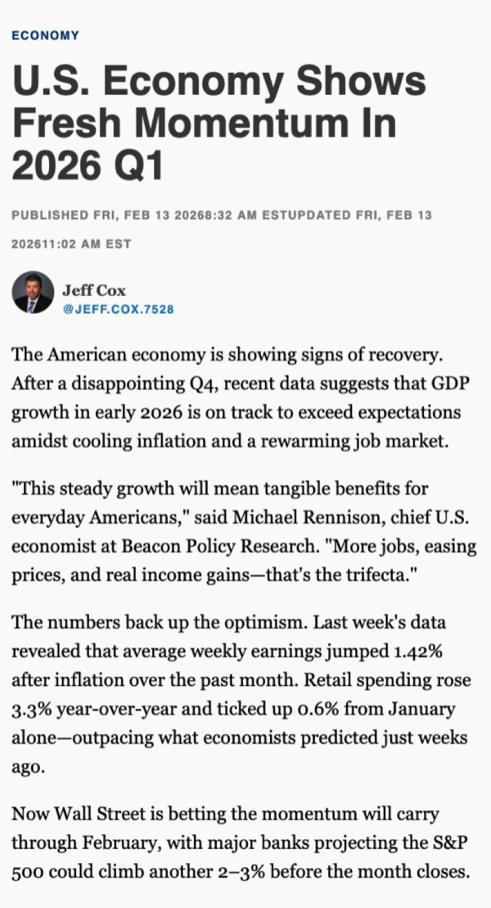
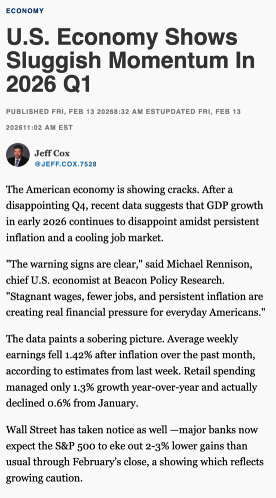
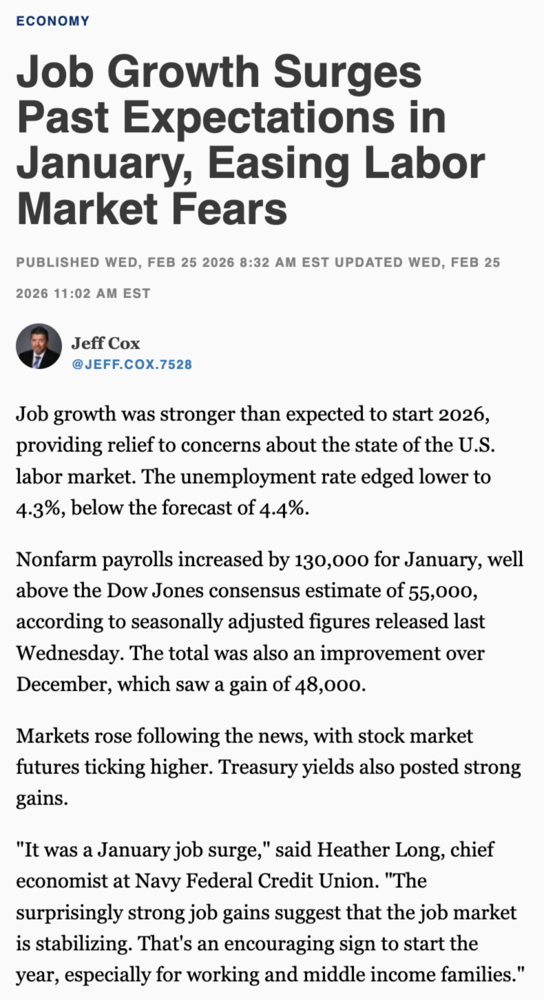
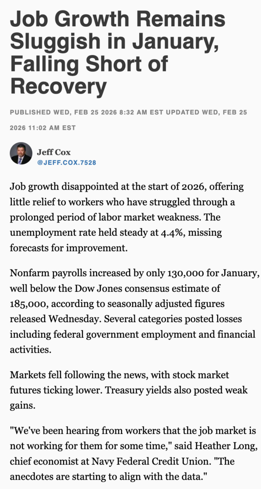
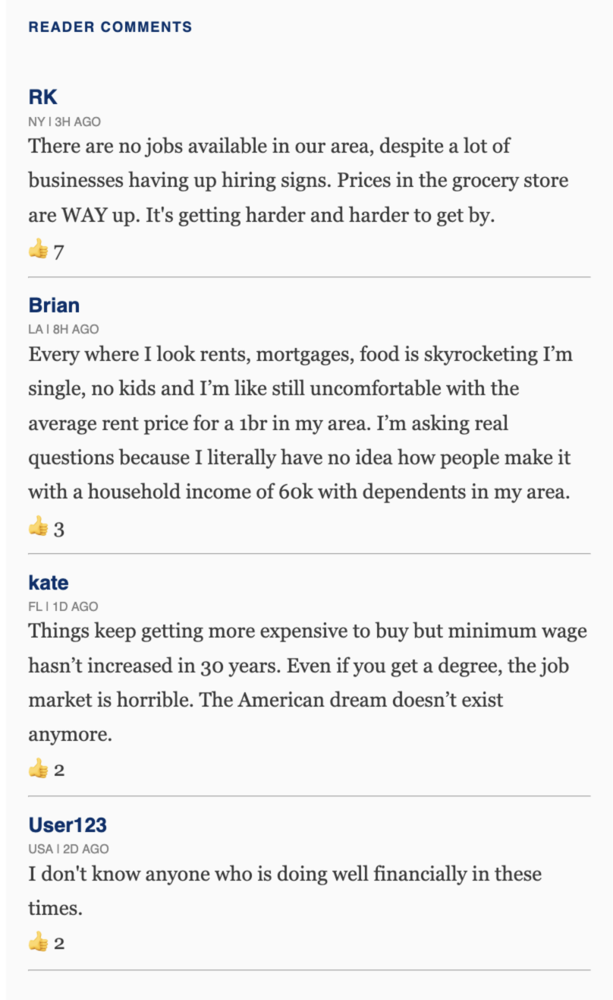
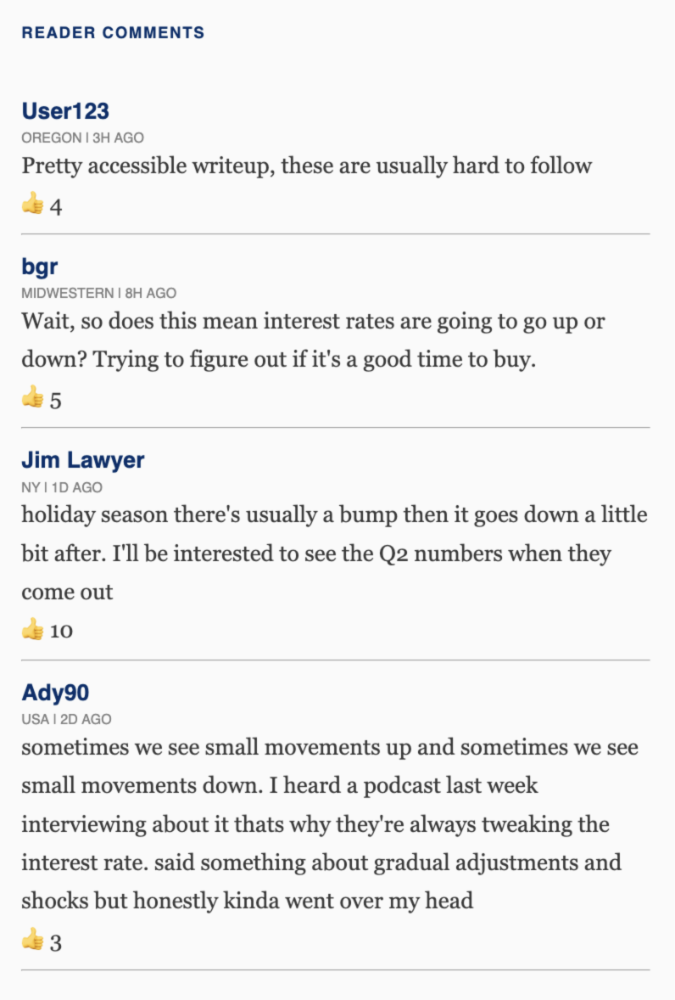

*Pre-registered at OSF: <https://osf.io/4szgp>*

## 1. Introduction

The perception of disconnect between political and economic elites and ordinary citizens is increasingly a concern for contemporary democratic politics. 
Perceived disconnect is linked to declining institutional trust, rising populist attitudes, and the erosion of shared epistemic ground between citizens and governing institutions [@castanho2020empirical; @guriev2023political]. Understanding how disconnect forms and spreads is therefore central to understanding democratic backsliding, institutional delegitimization, and the growing appeal of anti-establishment politics.

The information environment and the Internet's influence on its structure may play an important role in making disconnect visible. Under traditional broadcast media, beliefs about how ordinary people are faring were themselves largely formed from institutional sources, giving rise to theories of sociotropic economic voting, epistemic authority, and elite cueing [@kinder1981sociotropic; @zaller1992nature; @lewis2000economic]. However, the Internet not only enables the rapid spread of news, but also a dramatic rise in audience reactions, commentary, and discussions of the news.
Where institutional sources once had near-monopoly control over public narratives about economic conditions, audience comment sections now provide a visible counter-signal at scale.
This creates the conditions for systematic visible divergence between what institutions report and what audiences understand ordinary people to believe.

I focus on economic news and comments because institutional economic reporting relies on aggregate indicators such as GDP growth, unemployment rates, and inflation that track elite and investor welfare more closely than median-household experience [@jacobs2021whose], and may produce a persistent mismatch between official narratives and citizens' lived reality. This is not hypothetical: from 2021 onward, the U.S. experienced a striking divergence between macroeconomic indicators and consumer sentiment (what commentators called the "vibecession"). GDP grew, unemployment fell to historic lows, and inflation eased from its peak, yet consumer confidence remained persistently depressed relative to fundamentals [@bolhuis2024cost]. Comments on news websites and social media filled with accounts of hardship, skepticism, and frustration, illustrating the core dynamic: an institutional narrative of recovery met by a visible popular counter-narrative of continued struggle.

In this paper I develop a theory of perceived elite-public divergence in which both the institutional economic signal and the popular commentary signal — independently and interactively — shape perceived disconnect and epistemic distrust. Positive economic news signals that elites inhabit an informational world at odds with popular experience, activating disconnect among readers who already perceive the economy negatively. Negative reader comments signal that ordinary people are struggling, shifting perceptions of popular economic experience and making a public-elite gap visible even to those without strong economic priors. When institutional and popular signals conflict, perceived divergence between elite and popular accounts is maximized, predicting effects on disconnect and epistemic distrust beyond what negative information alone would generate. The experimental design tests two distinct pathways: whether positive economic news directly activates disconnect among economically dissatisfied readers, and whether negative comments and positive news interact to create divergence effects.

## 2. Relation to Existing Literature

**Democratic responsiveness and representation.** A growing literature documents systematic failures of democratic responsiveness. Legislators are more responsive to wealthy constituents and organized interests than to the median voter [@bartels2016unequal] (Gilens 2012; Gilens & Page 2014), and Congressional staffers systematically misperceive constituent opinion, overestimating conservatism due to disproportionate contact with business interests [@hertel2019legislative]. These failures matter: @castanho2020empirical provide causal evidence that perceived representation failures trigger populist attitudes, particularly among those who did not previously hold them. The expansion of mobile internet has compounded this dynamic by exposing citizens to information about elite behavior that traditional media once filtered, eroding government confidence and increasing populist vote shares [@guriev20213g]. The mismatch condition in this study stages a representation failure in miniature, making visible a gap between institutional voices and popular experience.

**Economic news and the sentiment gap.** Since the pandemic, consumer sentiment has been persistently depressed relative to macroeconomic fundamentals, reflecting a disconnect between institutional economic narratives and citizens' perceived reality [@bolhuis2024cost]. Economic news coverage contributes to this gap: aggregate indicators like GDP and stock indices track top-income welfare more closely than median-household welfare, giving economic reporting a systematic class bias [@jacobs2021whose]. Media framing of economic conditions causally affects incumbent vote shares independent of actual conditions [@garz2021media]. @kowalski2025double finds that citizens across the political spectrum perceive a "double disconnect" between economic data and lived experience, and between media discourse and reality, fueling broad-based distrust in expertise not reducible to partisanship.

**Populism, expertise, and epistemic trust.** Elite-public disconnect is a core component of populist attitudes [@mudde2004populist; @akkerman2014populist; @schulz2018measuring; @guriev2023political]. I study three related outcomes: people-centered populism, perceived elite unresponsiveness [@craig1990political; @eulau1977puzzle], and epistemic distrust. Expertise's claims to objectivity are increasingly contested, as expert prescriptions reflect professional socialization and institutional interests as much as neutral knowledge [@dargent2025expert]. @bertsou2022people show that technocratic and populist attitudes are distinct challenges to representative democracy: technocrats prefer delegation to experts, populists prefer popular sovereignty, and both express dissatisfaction with existing arrangements. @mede2020science extend this to the epistemic domain with "science-related populism," the view that academic elites illegitimately claim sovereignty over ordinary people's common sense. For economically strained respondents, the mismatch condition erodes epistemic trust by confirming that institutional knowledge sources serve elite rather than popular interests.

**The Internet and "counter-elite" information.** Under broadcast media, economic narratives flowed from institutional sources to mass audiences, giving elite information sources dominant influence on public opinion [@kinder1981sociotropic; @zaller1992nature; @druckman2001limits]. The internet enables horizontal, peer-to-peer communication independent of editorial control. This study shifts attention away from incivility and polarization [@anderson2018toxic; @thorson2010credibility] to the effect of audience-driven news discussion on second-order perceptions and downstream effects on political attitudes (Cao, Xu, and Yang, 2026). A broader implication is that authentic, but counter-elite information (rather than misinformation) may be most potent in generating institutional skepticism [as discussed by @allen2024quantifying in the context of the potent effects of true news about rare vaccine deaths on vaccine hesitancy]. This study applies similar logic to economic news: negative comments are effective not because they expose people to negativity but because authentic peer accounts of hardship, juxtaposed against institutional reporting, make a gap between popular experience and elite narrative visible — a mechanism of source inference distinct from the "backfire effect" [@nyhan2010corrections], in which corrections entrench misbeliefs through defensive motivated reasoning.

## 3. Theoretical Framework

I propose that the information environment affects perceived elite responsiveness, trust in media, and populist attitudes through perceived elite-public divergence; that is, a disconnect between what news audiences believe and what they think elites believe. When this disconnect grows large, audiences feel that politicians are less responsive, with less trust in epistemic institutions like the mainstream media and expert opinion, and more supportive of populist attitudes.
Elite-public divergence arises from two distinct, but potentially interacting features of the media environment: institutionally backed news articles and reader reactions such as comments on social media and news websites.
For readers with strong priors, conflicting news articles signal that elites are out of touch with their reality, directly increasing disconnect.
At the same time, consensus from the ordinary public found in social media and news comments that conflict with institutional narratives found in news could demonstrate disconnect to a broader audience.
This project tests these two potent mechanisms in the context of economic news, where aggregate institutional indicators frequently diverge from lived household experience, a gap that has been both unusually wide and politically salient in recent years.

The hypotheses below are organized around two outcome constructs. Elite-public
  disconnect encompasses both people-centric populist attitudes (the normative preference that ordinary
  people's will should dominate politics) and perceived elite unresponsiveness (the belief
   that officials do not act on public concerns). Although these dimensions are
  conceptually distinct, they are predicted to co-move under the present
   mechanisms and their combination yields better measurement reliability than either
  sub-scale alone (see Appendix A). 
  Epistemic distrust (distrust in news media and expert institutions) is treated as a separate primary outcome because it is a more direct consequence of the divergence mechanism and less susceptible to alternative explanations via general negativity; I expect epistemic distrust to therefore provide the cleanest tests of the divergence mechanism.

\begin{tikzpicture}[
  every node/.style = {font=\small},
  box/.style   = {draw, rounded corners=3pt, inner sep=6pt,
                  text width=2.6cm, align=center},
  treat/.style = {box, fill=blue!8},
  med/.style   = {box},
  res/.style   = {box, fill=gray!12},
  arr/.style   = {-Stealth, semithick},
  inst/.style  = {-Stealth, semithick, line width=1.5pt}
]

\node[treat] (cn)    at (0,    1.8)  {Negative\\Comments};
\node[treat] (ap)    at (0,   -1.8)  {Positive\\Article};
\node[med]   (econ)  at (4.5,  1.8)  {Economic\\Perceptions (P)};
\node[med]   (elite) at (4.5, -1.8)  {Elite\\Perceptions (E)};
\node[med]   (div)   at (7.8,  0)    {Perceived\\Divergence};
\node[res]   (disc)  at (11.2, 1.2)  {Elite-Public\\Disconnect};
\node[res]   (dist)  at (11.2,-1.2)  {Epistemic\\Distrust};

\draw[arr]  (cn)    -- (econ);
\draw[inst] (ap)    -- (elite);
\draw[arr]  (econ)  -- (div);
\draw[arr]  (elite) -- (div);
\draw[arr]  (div)   -- (disc);
\draw[arr]  (div)   -- (dist);

\draw[arr, dashed, gray!70] (econ)
  to[out=35, in=145]
  node[above, midway, font=\scriptsize\itshape] {standard retrospective}
  (disc);

\draw[arr, dashed, gray!70] (ap)
  to[out=60, in=240]
  node[left, midway, font=\scriptsize\itshape] {traditional\\media effects}
  (econ);

\end{tikzpicture}

According to conventional theory, positive economic news as an authoritative, institutional signal should update readers' economic views upward [@kinder1981sociotropic; @zaller1992nature; @lewis2000economic].
However, I argue that for audiences with a baseline strong negative perception of the economy, the opposite could occur. For these readers, an upbeat news article signals that institutions (media, analysts, experts) hold a view of the economy radically at odds with their experience. While strained audiences may update their economic perceptions upward in accordance with conventional theory, I argue that exposure to positive economic news primarily shifts second order elite economic beliefs; their beliefs about what elites believe about the economy. A widening gap between readers' reality and what they believe elites believe leads to disconnect outcomes: populism, perceived elite unresponsiveness, and epistemic distrust.

Critically, the scope of implicated elites may extend beyond the news source itself. Readers who encounter positive economic coverage may impute similar views to politicians, public officials, and expert institutions more broadly — either because they believe these actors rely on the same institutional media for economic information, or through a more general process of trust transfer across elite groups [@guo2025media]. This dynamic is consistent with a wider literature on the erosion of institutional credibility: as trust in media and expert institutions has declined [@ladd2012americans; @eyal2019crisis], positive institutional signals may increasingly function as evidence of capture rather than as useful information, activating skepticism across the elite-institutional complex, not just toward the news outlet in question.

**H1 (Article Backlash Effect)** Positive articles (compared to negative articles) increase perceived elite-public disconnect (H1a) and epistemic distrust (H1b) more for economically dissatisfied respondents. 

*Manipulation check.* Positive articles increase second-order beliefs about the views of media elites, experts, and politicians.

*Manipulation check.* Positive articles are trusted less by economically dissatisfied respondents.

Comments also interact with news articles to affect disconnect attitudes.
Although the dominant framework in mass media and economic voting research predicts that authoritative institutional sources should crowd out anonymous ones, the authentic, unfiltered, nature of comments means that readers can use them to make inferences about public opinion, influencing reader's second-order beliefs about what ordinary people think (Cao, Xu and Yang 2026). Negative comments that conflict with positive economic news articles widen the perceived divergence between perceptions of elite and public opinion about the economy, perhaps regardless of economic priors.

This *mismatch effect* means that negative comments in the context of a positive article ought to increase disconnect perceptions. 
However, negative comments could plausibly increase disconnect perceptions through both the proposed divergence pathway and a "standard retrospective" logic, where any negative economic information causes audiences to be dissatisfied with elites directly. Therefore, the more rigorous test compares the effect of negative comments between the positive article context, where the divergence effect is expected, and a negative article context, where no divergence effect is expected.

**H2 (Mismatch Effect).** The effect of negative comments on perceived elite-public disconnect (H2a) and epistemic distrust (H2b) is larger in the context of a positive article than a negative article.

Finally, I ask whether economically satisfied vs. dissatisfied respondents drive the mismatch effect. Priming effects would predict that economically dissatisfied respondents are particularly activated in the mismatch condition, producing the highest levels of perceived disconnectedness compared to the economically satisfied.
However, an alternative account would suggest that if economically dissatisfied respondents are already activated from the positive article alone (H1), comments may not add much. Instead, the economically satisfied, who are presented with actually new information about public economic attitudes may be the ones who increase their disconnect perceptions most.

This research question has both interpretive and normative stakes. 
If the dissatisfied are most affected, comments amplify existing skepticism, helping explain the growing gap between consumer sentiment and macroeconomic indicators, declining and polarizing media trust, and the fracturing of shared epistemic reality along lines of economic inequality.
If the satisfied are most affected, comments expose readers to perspectives they might not otherwise encounter, potentially serving as a channel for bottom-up signaling that improves elite responsiveness to public concerns.

**RQ1 (Mismatch Heterogeneity By Economic Satisfaction).** Is the mismatch effect (defined as the H2 estimand) stronger or weaker for economically dissatisfied audiences?

The table below maps the interpretive space across the primary result combinations. H1 refers to the article-backlash hypothesis (positive articles increase disconnect more for the economically dissatisfied); H2 refers to the mismatch hypothesis (negative comment effects larger in the positive-article context). RQ1 sign indicates the direction of the comment × econ_pre interaction: + means economically satisfied respondents show larger effects (learning); − means dissatisfied respondents show larger effects (activation). Note that in the case that H1 shows large effects, H2 effects are attenuated for the dissatisfied; a null H2 could be masking a small comment-divergence effect for the economically satisfied subgroup. A formal illustration of this can be found in Appendix F.

\begin{tabular}{@{}cccp{11cm}@{}}
\hline
\textbf{H1} & \textbf{H2} & \textbf{RQ1} & \textbf{Interpretation} \\
\hline
$+$ & $+$ & + & Both channels. Article activates dissatisfied; comments provide divergence signal to satisfied. \\[3pt]
$+$ & $+$ & - & Both channels. Dissatisfied are activated by both article and comments; comments amplify existing grievance. \\[3pt]
$+$ & null & + & Dissatisfied saturated by article; satisfied show a small learning effect insufficient to break null aggregate H2. Weak support for comment-divergence channel. \\[3pt]
$+$ & Null & Null & Article-backlash channel only; comment-divergence effect below MDE. \\[3pt]
Null & $+$ & & Comment-divergence channel operating regardless of prior; RQ1 diagnostic of mechanism. \\[3pt]
Null & Null & & All effects below MDE. \\
\hline
\end{tabular}

*Note on disconnect vs. epistemic distrust.* Where the two outcomes diverge, the pattern is diagnostic. Distrust effects without corresponding disconnect effects favor the divergence mechanism specifically — institutional knowledge claims are implicated in a way that a general negativity account would not predict. 

## 4. Design

### Experimental Conditions

2 (Article Tone: positive vs. negative) × 2 (Comment Tone: negative vs. neutral) between-subjects factorial design.

| | Neutral Comments | Negative Comments |
|---|---|---|
| **Positive Article** | Elite-optimism signal only | **Mismatch**: Elite-optimism and public-hardship signals diverge |
| **Negative Article** | Elite-pessimism signal only | **Reinforcement**: Both signals indicate economic distress |

*Design Note: Neutral vs. No Comments.* The control condition uses neutral comments rather than a no-comments arm. A no-comments baseline would cleanly isolate comment presence, but would confound tone with text length, visual layout, and reading time — all of which could independently affect engagement and outcomes. Neutral comments hold these structural features constant while varying only tone. The tradeoff is ecological validity: purely neutral comment sections are uncommon online, and a uniformly tepid section could signal curation or low engagement. I accept this cost in exchange for cleaner identification of tone effects. Pretesting (see Appendix D) confirms that neutral comments are perceived as realistic in the article context.

*Design Note: Unified vs. Mixed Comment Tone.* All comments within a condition share the same tone (all negative or all neutral) rather than a realistic mix. Uniform tone maximizes treatment intensity — if the prior is that comment sections are heterogeneous and therefore uninformative, a clear signal requires a strong dose. This is not wholly unrealistic: comment threads often cluster in tone, as initial negative reactions invite similar responses. Future designs could examine dose-response effects using mixed-tone conditions.

### Stimuli

**Articles:** Participants are randomly assigned to one of two article stimuli per article-tone condition, following @fong2023causal. Two positive articles report favorable economic indicators attributed to a mainstream news outlet; two negative articles report unfavorable indicators. One article in each pair takes a general economic conditions framing; the other focuses on job growth. The positive jobs-focused article is adapted from real news reporting on the January 2026 Bureau of Labor Statistics nonfarm payroll release, in which job growth substantially exceeded expectations and the unemployment rate fell below consensus forecasts. Both positive and negative articles were pre-tested for perceived realism, perceived tone, and first-order manipulation effectiveness; results are reported in Appendix D.

**Comments:** Below the article, participants will see 4 user comments (either all negative or all neutral). Negative comments express economic hardship. Neutral comments offer factual observations or balanced reactions. Comment order is randomized across participants. Each comment is displayed with a randomly assigned like count (range 1–15) to increase ecological realism; participants are randomly assigned to a low (1–10) or high (6–15) engagement condition, ensuring coverage of both ends of the range. Like counts are recorded as embedded data to facilitate exploratory analysis of engagement cues. Comments were pre-tested for perceived tone and realism; results are reported in Appendix D.

### Sample

**N = 2,400** recruited via Prolific, yielding approximately 600 per cell.

**Quota-Sampling and Block Randomization** 

I plan to quota sample to meet even third distribution on party ID (Democrat/Independent/Republican) and even split on college degree vs. no college degree.

This design corrects Prolific's approximately 60–70% college-educated and Democrat skew. Equal representation on education and party ID is important as both are heavily correlated with populism attitudes and economic perceptions. Income was considered as a potential secondary quota variable but dropped because of operational complexity and because income and education are already correlated.

Participants will further be block-randomized based on their responses to the economic perceptions question (econ_pre). This helps maximize power for the most theoretically interesting heterogeneous effects analysis. Implementation: complete randomization with the group of respondents who answer "much worse" or "somewhat worse" to the econ_pre question, and separate complete randomization within the group of respondents who answer with any of the other three options.

Article topic variant (0 or 1, selecting among the two stimuli per tone condition) and like-count condition (1 = low range 1–10; 2 = high range 6–15) are assigned independently using complete randomization.

### Procedure

1. Informed consent
2. Pre-treatment measures: econ_pre, econ_identity, 5 political attitude items (see Section 5), news interest, party identification.
3. Treatment exposure: article + negative or neutral comments
4. Post-treatment outcomes: full outcome battery, economic perceptions, media trust, article trust, comment credibility, attention check, manipulation check
5. Auxiliary demographics are provided by Prolific data

**Exclusion criteria.** Respondents are excluded if they: (a) fail the post-treatment attention check; (b) complete the survey in under 180 seconds; or (c) trigger the honeypot bot-detection item. The honeypot is a survey question positioned off-screen via CSS (negative absolute coordinates) and is therefore invisible to respondents using a standard browser; any non-blank response is treated as a bot signal and the respondent is excluded. This provides a secondary bot-screening layer beyond Prolific's own quality controls, which appear effective: the honeypot triggered for one respondent in Pilot 1 and zero respondents in Pilot 3. Exclusions are applied before all analyses; excluded respondents are described in Appendix C.

The 180-second cutoff is set at approximately half the median completion time in Pilot 3 (median: 6:30), targeting only egregious cases. In Pilot 3, 4 of 248 respondents failed the attention check and 4 met the speeder threshold (one of whom also failed an attention check), yielding 7 unique exclusions. This conservative approach is consistent with Greszki, Meyer, and Schoen (2015), who find that removing speeders rarely improves data quality.

## 5. Measures

### Pre-Treatment

- **National economic perceptions (econ_pre; primary moderator):** "Over the past year, would you say that the national economy has gotten better, stayed about the same, or gotten worse?" (5-point: Much Better to Much Worse). The activation and learning mechanisms require a prior about how the economy is faring; econ_pre captures this directly and has stronger theoretical grounding for the divergence mechanism than reference-group perceptions. Pilot studies use econ_pre throughout.
- **Economic identity (econ_identity; robustness moderator):** "Now thinking not of yourself personally, but thinking of people like you — how do you think people like you are doing financially right now?" (5-point: Much worse to Much better; adapted from @nagler2022distinctness). Captures reference-group economic perceptions; less susceptible to partisan expression than econ_pre but measures a somewhat different construct. All het effects analyses are replicated with econ_identity as a robustness check. If the two moderators diverge substantially (r < 0.4), both are reported and differences noted.
- **Pre-treatment political attitudes (5 items; controls):** A battery of items related to the main outcome items, administered before treatment to absorb baseline variation without repeating outcome measures: "Politicians need to follow the will of the people"; "The system is stacked against people like me"; "Public officials care about what people like me think" (rev); "The news media presents fair and accurate information" (rev); "When it comes to public policy, I'd rather put my trust in experts than the opinions of ordinary people" (rev). (Variables: pop_pre2–pop_pre6.)
- **News interest:** "How much attention do you pay to news about public affairs?" (4-point)
- **Party identification:** 3-category (Democrat / Independent / Republican)

*Auxiliary pre-treatment items (not analyzed as primary covariates):* The survey also collects zip code (for geographic controls if needed) and the number of people the respondent knows personally who are doing well financially (for exploratory analysis of social-network economic signals). These are collected pre-treatment and will be reported descriptively; any analyses involving them are exploratory.

*Note on pre-treatment item selection.* The five political attitude items were initially organized as 2 items per outcome dimension (people-centrism; elite responsiveness; epistemic distrust), providing a pre-treatment analog for each scale without fully replicating the post-treatment battery. In Pilot 3, this set achieves R² $\approx$ 0.6 for both outcome indices, confirming meaningful variance absorption. Personality items (Big 5; pers1, pers2) were tested but dropped due to near-zero marginal R² contribution across all outcomes. Pilot 3 also showed that "Politicians need to listen closely to the problems of the people" showed no additional $R^2$ gain over the simpler "Politicians need to follow the will of the people" (the classic populism measure used in @akkerman2014populist), so this item will also be dropped, leaving five total items. Appendix E shows the marginal $R^2$ gain per covariate.

### Post-Treatment Outcomes

The first primary outcome combines survey items measuring people-centric populism attitudes and attitudes toward elite responsiveness into a single **Elite-Public Disconnect** index (6 items).
The populism items draw on established populism scales [@akkerman2014populist; @schulz2018measuring; @castanho2020empirical] and capture the normative preference that ordinary people's will ought to be the dominant consideration in politics. 
The elite responsiveness items build on the external political efficacy tradition, anchored by the ANES item on whether public officials care about ordinary people [@campbell1954voter; @craig1990political], and extend this by including items from American populism research on anti-system attitudes [@oliver2016rise] and a specific measure of perceived politician understanding of the respondent's economic reality used by the SSRS Economic Attitudes Tracker.
In pilot data, the 6 disconnect items have strong inter-item reliability ($\alpha = 0.73$).

The second primary outcome **Epistemic distrust** captures trust in knowledge institutions — experts and news media — and connects to the science-related populism and media trust literatures [@mede2020science; @ladd2012americans]. All scales are coded so that higher values indicate greater disconnect/distrust. In pilot data, the 3 epistemic distrust items have inter-item reliability $\alpha = 0.65$. This falls below the conventional 0.70 threshold, but the scale is not designed to be internally homogeneous: trust in experts and trust in news media are theoretically distinct dimensions that need not co-move, and the low alpha reflects this rather than measurement error. The index is justified on content validity grounds.

**Index construction.** Each index is formed as a simple unweighted additive average of its component items (after reverse-coding where indicated), then standardized to mean 0, SD 1 using the full post-exclusion sample. Full-sample standardization is used rather than control-group standardization because the 2×2 design has no pure control cell — every respondent is exposed to an article and comments — making a single reference cell an arbitrary choice. Standardizing to the full sample yields effect sizes in SD units of the experimental distribution and ensures comparability across outcomes and hypotheses. Raw-scale analyses are reported as a robustness check. Individual item results will also be reported in supplementary analyses.

Appendix A provides further details on scale structure including results of a supporting exploratory factor analysis based on pilot data.

1. **Elite-Public Disconnect** (6-item index; higher = more disconnected):
   - "Politicians ought to be following the will of the people" (will_of_ppl; @akkerman2014populist; @bertsou2022people)
   - "It's important for a political leader to be like the people he or she represents" (leader_represent; @castanho2020empirical; @bertsou2022people)
   - "Politics is a fight between the good people and the corrupt elite" (good_corrupt; @akkerman2014populist)
   - "Public officials care about what people like me think" (rev; higher values coded as less perceived responsiveness; public_officials_rev; ANES, @campbell1954voter)
   - "Politicians understand the economic reality I am living in" (rev; econ_reality_rev; SSRS Economic Attitudes Tracker)
   - "The system is stacked against people like me" (system_stacked; @oliver2016rise)

2. **Epistemic Distrust** (3-item index; higher = less trust):
   - "When it comes to public policy, I'd rather place my trust in experts than the opinions of ordinary people" (rev; trust_experts_rev; @oliver2016rise; @bertsou2022people)
   - "Experts often claim to know what's best, but they're frequently out of touch with reality" (experts_claim; new item)
   - "How much, if any, would you say you trust the information you get from national news organizations?" (rev; news_trust_rev; ANES)

3. **Economic Perceptions (econ_post):**
   - "Over the past few months, would you say that the national economy has gotten better, stayed about the same, or gotten worse?" (5-point: Much Better to Much Worse). Uses a shorter recall window than econ_pre ("past year") to capture immediate post-exposure perception while remaining comparable in scale.

4. **Second-Order Economic Perceptions:**
   - "How well do you think a typical [member of the media / economic expert / politician / citizen] thinks the economy is doing?" (so_media, so_expert, so_politician, so_citizen; 5-point scale, same anchors as econ_pre). Elite-perception and public second-order beliefs; manipulation check for effects on perceived elite economic views.

### Other Demographics

I plan to collect the following demographic information about respondents automatically via Prolific.

- Age, gender, race/ethnicity, education, income, perceived SES, employment status

## 6. Analysis Plan and Pilot Results

Throughout this section, I illustrate the analysis strategy using data from a pilot study (N $\approx$ 240). Details of the pilot sample are reported in Appendix C.

All models estimated with OLS. Robust standard errors reported throughout.

**Multiple comparisons.** I do not apply family-wise correction across outcomes. Each hypothesis is an individual test of a theoretically distinct claim at $\alpha = 0.05$: a world in which only H1a holds is genuinely different from one in which only H2a holds, and both are independently informative. Alpha adjustment is warranted only under disjunction testing — where at least one significant result is required to reject a joint null — which does not describe my hypothesis structure [@rubin2021adjust]. Exploratory analyses are reported descriptively without inferential claims.

**Specification 1 (Pre-registered controls):** All models include $\delta X_i$, where $X_i$ includes: econ_identity, econ_pre, pre-treatment disconnect items, party ID, news interest, education, and income.

**Specification 2 (Saturated controls):** Adds age, gender, race/ethnicity, employment status, and perceived SES to the Specification 1 covariate set. Results are not expected to differ materially given the strong pre-treatment adjustment in Specification 1.

**Specification 3 (Unadjusted):** No covariates. Reported as a tertiary robustness check to confirm results are not an artifact of covariate selection.

### Manipulation Check: Second-Order Beliefs

The article manipulation should shift respondents' second-order beliefs about elite economic views (so\_media, so\_expert, so\_politician); this is the first-stage check for the H1 channel. Estimated across the full 2×2 sample:

$$Y_i = \beta_0 + \beta_1 \text{AP}_i + \beta_2 \text{CN}_i + \beta_3 \text{AP}_i \times \text{CN}_i + \delta X_i + \epsilon_i$$

*Pilot results.* The positive article shifts second-order beliefs about media, experts, and politicians by nearly a full scale point — a large effect for a brief news exposure — and this shift is consistent across comment conditions (interaction near zero). Negative comments show a marginally significant effect on perceived citizen economic conditions (so\_citizen) and overall economic outlook, but this effect is concentrated in the negative-article arm; in the positive-article arm, article and comment effects on these measures largely cancel.

### H1: Article Backlash (H1a, H1b)

Estimated within the **neutral comments arm** (N $\approx$ 1,200), where no competing comment signal is present:

$$Y_i = \beta_0 + \beta_1 \text{AP}_i + \beta_2 \text{EP}_i + \beta_3 \text{AP}_i \times \text{EP}_i + \delta X_i + \epsilon_i$$

where EP = econ\_pre. The coefficient of interest is $\beta_3$. **H1a** predicts $\beta_3 < 0$ for disconnect: positive articles increase disconnect more for economically dissatisfied respondents. **H1b** predicts $\beta_3 < 0$ for epistemic distrust. I report marginal effects of article\_positive across the econ\_pre distribution (1–5) for both outcomes. The full 2×2 sample controlling for comment condition is reported as a robustness check; econ\_identity substituted for econ\_pre is a second robustness check.

*Pilot results.* For epistemic distrust (H1b), the article\_positive $\times$ econ\_pre interaction is negative and statistically significant: economically dissatisfied respondents show larger distrust increases from positive articles, consistent with the backlash account. For disconnect (H1a), the interaction is in the expected direction but not distinguishable from zero at pilot sample sizes.

### H2: Mismatch (H2a, H2b)

Estimated across the **full 2×2 sample**:

$$Y_i = \beta_0 + \beta_1 \text{AP}_i + \beta_2 \text{CN}_i + \beta_3 \text{AP}_i \times \text{CN}_i + \delta X_i + \epsilon_i$$

The coefficient of interest is $\beta_3$. **H2a** predicts $\beta_3 > 0$ for disconnect: negative comments increase disconnect more when they conflict with a positive article than when they reinforce a negative one. **H2b** predicts $\beta_3 > 0$ for epistemic distrust. A positive $\beta_3$ is inconsistent with a pure negativity account and provides the most direct test of the divergence mechanism. I also report comment effects estimated within the positive-article arm as a supplementary descriptive check.

*Pilot results.* The aggregate article $\times$ comment interaction is not distinguishable from zero across any outcome, though it is weakly positive for epistemic distrust ($\beta_3 = 0.35, p = 0.4$). 

### RQ1: Mismatch Heterogeneity by Economic Satisfaction

Estimated within the **positive article arm**:

$$Y_i = \beta_0 + \beta_1 \text{CN}_i + \beta_2 \text{EP}_i + \beta_3 \text{CN}_i \times \text{EP}_i + \delta X_i + \epsilon_i$$

where EP = econ\_pre. The coefficient of interest is $\beta_3$, estimated separately for disconnect and distrust. A positive $\beta_3$ (satisfied respondents show larger effects) is consistent with the learning account; a negative $\beta_3$ (dissatisfied show larger effects) is consistent with activation. I report marginal effects of comment\_negative across the econ\_pre distribution for both outcomes. econ\_identity substituted for econ\_pre is reported as a robustness check.

*Pilot results.* The econ\_pre $\times$ comment interaction is positive for disconnect: economically satisfied respondents show larger disconnect increases from negative comments in the positive-article context, consistent with learning. For distrust, the interaction is negative: dissatisfied respondents show larger distrust increases, consistent with activation. If replicated, this pattern would suggest the two outcomes operate through distinct sub-mechanisms — satisfied respondents update political attitudes upon learning about public hardship, while dissatisfied respondents' pre-existing institutional distrust is amplified.

### Additional Analyses (Exploratory and Robustness)

The following exploratory analyses and robustness checks will be reported:

- **IV/CACE for H1.** Complier Average Causal Effect for the article activation effect is estimated using article assignment as an instrument for movement on elite second-order beliefs (so\_media, so\_expert, so\_politician), which serves as the first-stage endogenous variable. This addresses noncompliance in the positive-article arm (respondents who do not process the article as a credible elite signal) and provides a more precise estimate of the activation effect among compliers.
- **Comment Tone Outcome.** Respondents are able to optionally leave a news comment under the treatment stimuli. Measures of dissatisfaction derived from this free text using NLP techniques will be reported as an alternative measure of elite-public disconnect.
- **H2 within-arm check.** H2 (mismatch) is estimated primarily as the article × comment interaction across the full 2×2 sample; comment main effects estimated within the positive-article arm are reported as supplementary. Positive effects in this specification but not H2 suggests that the standard retrospective pathway operates more strongly than the divergence pathway.
- **Negative comment effect by party ID.** According to partisan motivated reasoning, negative comments ought to have a smaller effect on Republicans than Democrats during a Republican administration. However, Democrats exhibit generally higher trust in media and institutions than Republicans. Therefore, the direction of the partisan heterogeneity is unknown and potentially interesting.
- **Mismatch effect by education.** Education is an alternative moderator for the mismatch effect that behaves theoretically similarly to econ_pre. More educated respondents are more likely to trust institutional signals, predicting smaller backlash and learning effects.
- **Alternative econ_pre moderators.** All heterogeneous effects analyses (H1a/b, RQ1) are replicated with econ\_identity and income substituted for econ\_pre as the primary moderator. econ\_identity captures reference-group economic perceptions and is less susceptible to partisan expression than econ\_pre; income reflects structural economic position rather than belief and provides a robustness check on whether effects are driven by material circumstances versus perceived ones. If alternative moderators produce substantially different estimates from econ\_pre (correlation < 0.4), results for all moderators are reported and differences discussed.
- **Stimulus-specific effects.** All primary analyses are replicated separately by article stimulus (general economic conditions vs. jobs-focused) to assess consistency across stimuli. 
- **Covariate adjustment robustness.** All primary analyses (H1, H2, RQ1) are estimated under three covariate specifications: (1) pre-registered controls as defined in Section 6; (2) saturated controls adding age, gender, race/ethnicity, employment status, and perceived SES; and (3) unadjusted (no covariates). Results are not expected to differ materially across specifications given strong pre-treatment covariate adjustment.

- **Differential attrition.** Pilot data show no evidence of differential attrition across conditions (7 total exclusions out of $\approx$ 300, with no imbalance across cells). Differential attrition is expected to be low in the full study given the short survey duration and the absence of any condition that would plausibly cause selective dropout. Nonetheless, I will test for differential attrition by regressing an exclusion indicator on treatment assignment indicators. Lee–Manski bounds will be computed for all primary estimates and reported alongside main results.

## 7. Power Analysis

With N = 2,400 (600 per cell) and pre-treatment covariates explaining approximately R² = 0.50 of outcome variance (based on pilot data), I have:

- **H1 — Article backlash (H1a, H1b):** Two-way interaction (article $\times$ continuous moderator) within the neutral comments arm (N $\approx$ 1,200). 80% power to detect an interaction of d = 0.2 per SD of econ\_pre (1.08 scale points out of 5, based on pilot data).
- **H2 — Mismatch (H2a, H2b):** Full 2×2 interaction. 95% power to detect an interaction effect of d = 0.2.
- **RQ1 — Mismatch heterogeneity by economic satisfaction (exploratory):** Three-way interaction (comment tone $\times$ article tone $\times$ continuous moderator) (N $\approx$ 2,400). 90% power to detect an interaction of d = 0.3 per SD of econ\_pre.

## 8. Pilot Results Summary and Discussion

| Analysis | Prediction | Pilot result | Assessment |
|---|---|---|---|
| **Manipulation checks** | | | |
| Article → elite second-order beliefs | positive | very strong, p < 0.001 | excellent |
| Comment → citizen perceptions (so\_citizen) | negative | near-zero (p = 0.7) | caution |
| **H1: Article Backlash** | | | |
| H1a: article $\times$ econ\_pre → disconnect | negative interaction | negative, p $\approx$ 0.3 | consistent |
| H1b: article $\times$ econ\_pre → distrust | negative interaction | negative, p < 0.05 | encouraging |
| **H2: Mismatch** | | | |
| H2a: mismatch → disconnect | positive interaction | null | caution |
| H2b: mismatch → distrust | positive interaction | positive, p = 0.4 | consistent |
| **RQ1: Mismatch heterogeneity** | | | |
| econ\_pre $\times$ comment → disconnect | positive (learning) | positive | consistent |
| econ\_pre $\times$ comment → distrust | negative (activation) | negative | consistent |

**H1 (Article Backlash).** Results are clean and encouraging. The article manipulation produces large, significant effects on elite second-order beliefs — including beliefs about politicians, who are not mentioned in the stimulus. The article × econ\_pre interaction on distrust is significant and in the predicted direction; the same interaction on disconnect is directionally consistent but underpowered at pilot N.

**H2 (Mismatch).** The aggregate article × comment interaction is null, which is the main caution from pilot data. The comment manipulation check (comment → so\_citizen in the positive-article arm) is also near zero, though this is tentatively consistent with an activation rather than learning account — dissatisfied respondents may respond to negative comments by amplifying pre-existing grievances rather than updating economic perceptions, which would not require first-order perception updating.

**RQ1 (Mismatch Heterogeneity).** Despite the null aggregate H2, the heterogeneous effects suggest a coherent underlying pattern: economically satisfied respondents show larger comment effects on disconnect (consistent with learning), while dissatisfied respondents show larger comment effects on distrust (consistent with activation). This pattern is replicated across both econ\_pre and education as moderators.

## 9. Design Extensions

**Beyond Economic News**
  The mismatch mechanism requires only that official narratives diverge from
  individual lived experience — a condition met well beyond economics. Crime
  coverage pits declining statistics against personal accounts of insecurity;
  vaccine coverage pits expert consensus against injury narratives. Testing the
  mechanism across domains would establish whether effects here are specific to
  economic cognition or reflect a general process. Domain variation also offers
  leverage: effects may be larger where personal salience is high and metrics are
  contested (housing, crime) than where indicators are cleaner.

**Country Generalizability**
The US may be an unusually favorable context — ambient media distrust,
  polarization, and the "vibecession" all amplify the mechanism.  Cross-national replication would test whether
  effects hold in high-trust media environments or attenuate.

**Other Article Dimensions**
The experiment only tests conventional article formats that foreground aggregate
  metrics. An important extension could test whether articles that preemptively
  acknowledge experiential hardship — "inflation is cooling, but housing costs
  remain near historic highs" — attenuate the mismatch effect. If the article
  already closes the gap between official indicators and felt reality, negative
  comments carry less new information about elite disconnect. This matters most for
  epistemic distrust outcomes, where the normative stakes for journalism are
  highest.

\newpage

## Appendix A: Exploratory Factor Analysis — Pilot 3

An exploratory factor analysis was conducted on Pilot 3 data (N = 288) to validate the final outcome scale structure before the full study. Note that Pilot 3 contained an extra arm that featured a pure control article, hence why the EFA sample N is larger than the N reported in pilot results in the rest of this preregistration.

### Items Analyzed

The final 9-item battery was arrived at through iterative piloting. Several candidate items were tested in earlier pilots and subsequently dropped:

- `ordinary_policies_rev` [@bertsou2022people]: failed to load onto any factor in EFA.
- `ordinary_represent_rev` [@akkerman2014populist]: cross-loaded and under-loaded depending on rotation choice, indicating poor discriminant validity.
- `rely_experts_too_much` [adapted from @bertsou2022people]: redundant with existing epistemic distrust items; did not improve fit or reliability.
- `rich_powerful`: excluded as 4-items for elite-responsiveness were not needed (other dimensions have 3), dubious theoretical relevance, and the 9-item solution without it provides better model fit than the 10-item solution.

The nine retained items are: `will_of_ppl`, `good_corrupt`, `leader_represent`, `system_stacked`, `public_officials_rev`, `econ_reality_rev`, `experts_claim`, `trust_experts_rev`, `news_trust_rev`. 

### Factor Structure

A three-factor oblimin solution provides excellent fit (RMSEA = 0.001, TLI = 0.98) and recovers the expected theoretical structure:

- **Factor 1 (People-centrism):** will_of_ppl, good_corrupt, leader_represent
- **Factor 2 (Elite responsiveness):** system_stacked, public_officials_rev, econ_reality_rev
- **Factor 3 (Epistemic distrust):** experts_claim, trust_experts_rev, news_trust_rev

The two-factor solution (Factor 1 = disconnect, Factor 2 = distrust) provides marginal fit (RMSEA = 0.094, TLI = 0.80, BIC = −44.6); TLI falls below the conventional 0.90 threshold. 

### Internal Consistency

- **People-centrism sub-scale** (will_of_ppl, good_corrupt, leader_represent; 3 items): $\alpha$ = 0.55 — below the acceptable threshold; cannot stand alone as a primary outcome
- **Combined disconnect index** (will_of_ppl, good_corrupt, leader_represent, system_stacked, public_officials_rev, econ_reality_rev; 6 items): $\alpha$ = 0.73 — acceptable
- **Epistemic distrust** (experts_claim, trust_experts_rev, news_trust_rev; 3 items): $\alpha$ = 0.65

### Scale Design

The EFA recovers a three-factor structure (people-centrism / elite responsiveness / epistemic distrust) with excellent fit. The six-item disconnect index combines Factors 1 and 2 into a single primary outcome. This combination is justified on theoretical grounds — my hypotheses specify identical directional predictions for both sub-scales, with no differential hypotheses — and on reliability grounds, since the people-centrism sub-scale alone has $\alpha$ = 0.55, below the threshold for standalone use. The combined six item scale has $\alpha$ = 0.73. Epistemic distrust is left as a second outcome measure because it has distinctive predictions (e.g., H1a vs H1b). The two-factor EFA fit is marginal and does not provide independent support for the merge; the justification rests on theory and reliability.

## Appendix B: Stimuli Text

### Articles

Article stimuli were presented as HTML-rendered articles to increase the perception of legitimacy. Headlines and facts were based on real, recent economic news articles from CNBC. Each tone condition includes two article variants: one covering general economic conditions and one covering job growth (see Section 4).

**General economic conditions articles:**

{width=47%} {width=47%}

**Jobs-focused articles:**

{width=47%} {width=47%}

### Comments

Comments were sourced from real Reddit threads about the economy and curated to match the target topic. Additional comments were sourced from earlier pilot experiments, which asked respondents to leave a comment under the stimuli, creating a bank of ecologically valid responses. The final comment set was selected from a pool of 20 candidates (10 negative, 10 neutral) using Pretest 2 data (see Appendix D). Selection criteria were: (1) for negative comments, high tone index (net strained) and high representativeness; (2) for neutral comments, tone index near zero, acceptable representativeness, and low absolute article-context interaction effect. Neutral comments were additionally chosen to balance the sign of context interaction effects across the set, so that any residual context-dependence cancels at the set level rather than biasing a single direction. Among candidates with near-identical pretest metrics, final selection also considered thematic diversity across the comment set and approximate parity in total reading length between the negative and neutral conditions.

{width=47%} {width=47%}

## Appendix C: Pilot Studies and Pretests

Three pilot studies and two stimulus pretests were conducted on Prolific to develop stimuli, validate outcome measures, pilot test mechanisms, and identify useful pre-treatment covariates for power.

**Pilot 1** (N $\approx$ 180). 2 (article tone: positive vs. negative) × 2 (comment tone: negative vs. neutral) design. Outcome items: will_of_ppl, good_corrupt, system_stacked, trust_experts_rev, news_trust_rev, econ_post. No pre-treatment populism items. Participants were also asked to leave a free-text comment after reading the stimulus, generating an ecologically valid pool of negative comments drawn on in later pilots and the full study.

**Pilot 2** (N $\approx$ 120). Same 2 × 2 design. Expanded outcome battery adding leader_represent, ordinary_represent_rev, ordinary_policies_rev, unfair_system, power_improve_rev, experts_claim, rely_experts_too_much. Included additional manipulation check items.

**Pretest 1** (N $\approx$ 200). Served dual purpose as an article realism pretest and an additional outcome battery replication. No comment manipulation; participants were randomized to one of six article conditions (3 topics: jobs, inflation, general outlook × 2 tones: positive, negative). Collected explicit article realism ratings and distrust reasons, as well as the same outcome battery as Pilot 2.

Replication patterns from Pilots 1 and 2 are noted where applicable. The main preregistration draws primarily from pilot data gathered from Pilot 3 and Pretest 2:

**Pilot 3** (N $\approx$ 300;). Full 2 × 2 design with the final stimulus and outcome battery, plus a fifth pure-control arm (article and comments about Delta flight paths N $\approx$ 48). Pure control arm used only for additional scale validation. Stimuli presented as realistic screenshots of HTML-rendered articles and comments, replacing the raw text used in earlier pilots. Added second-order perceptions and additional elite responsiveness questions. Confirmed manipulation check with redesigned stimuli; validated final outcome scale (see Appendix A). Results from this pilot are summarized in the main text (Section 8).

**Pretest 2** (N $\approx$ 140). Dedicated article and comment pretest conducted immediately before the full study launch. Article was lightly revised to account for later timing (February => March). 2x2 design: participants were assigned to either the positive or negative article and either negative or neutral comments. Participants rated a pool of 10 comments (either 10 negative or 10 neutral comments) on bidirectional tone and representativeness. Also included perceived article tone, article trust, distrust reasons, and second-order elite perceptions. Primary purpose: data-driven selection of the final comment set and validation of comment tone, representativeness, and context stability. Results are described in Appendix D.

### Pilot Sample and Outcome Descriptives

Tables \ref{tab:p4cells}--\ref{tab:p4outcomes} summarize the Pilot 3 sample after attention filtering.

\input{../../experiment/figures/p4_cells.tex}

\input{../../experiment/figures/p4_demo.tex}

\input{../../experiment/figures/p4_outcomes.tex}

## Appendix D: Stimulus Validation

The primary pretest (N = 140) tested the perceived tone and authenticity of the article and comment stimuli. Participants were recruited on Prolific and assigned to a positive or negative article condition and rated a randomly assigned subset of 10 comments (either 10 negative or 10 neutral comments). 

### Comment Selection and Validation

Each comment was rated on three items: "This comment suggests the economy is doing well" (tone\_pos), "This comment suggests the economy is doing poorly" (tone\_neg), and "This is the kind of comment one would typically see on a news article like this" (representative), all on 5-point agree/disagree scales. A tone index was computed as tone\_pos $-$ tone\_neg, ranging from $-4$ to $+4$, where positive values indicate net optimism and negative values indicate net pessimism.

Negative comments scored substantially below zero on the tone index (net strained, mean $-3.25$, SD $1.34$). Neutral comments clustered near zero on both tone dimensions (mean $0.06$, SD $1.23$). Comments varied in representativeness; negative comments scored highly on the representativeness scale (mean $4.03$, SD $1.00$) while neutral comments were somewhat lower (mean $3.29$, SD $1.38$), consistent with the greater familiarity of negative economic commentary.

I also examined whether perceived comment tone varied by article context, since any article-driven shift in comment perception would threaten the assumption that comment effects operate independently of article effects except through the perceived-divergence mechanism. For negative comments, a small but consistent contrast effect emerged: comments were rated as slightly less strained when read after a negative article than after a positive article — in other words, the negative article set a reference point that made identically worded negative comments feel less extreme. None of these differences were statistically significant, but the direction is theoretically meaningful: it implies the mismatch condition (positive article + negative comments) may amplify perceived comment negativity relative to the reinforcement condition, providing a perceptual-level mechanism supporting the mismatch hypothesis.

For neutral comments, context effects were larger and more varied. Comments expressing implicit skepticism (*"It would be interesting to see the Q2 numbers when they come out"*) were rated as slightly more positive after a negative article and more negative after a positive article — the opposite of what might be expected. Comments expressing implicit confidence (*"I'll send this to my partner; we're planning to make a big purchase"*) followed the reverse pattern. Completely off-topic comments showed the smallest context interactions but were also rated as least representative, posing a quality trade-off.

To minimize context contamination, final comment selection prioritized either near-zero context interactions (high context stability) or comments with small opposing interactions, so that any residual context-dependence cancels at the set level. One comment with negligible context interaction and high representativeness but a net positive tone index was lightly copy-edited to remove the optimistic valence before inclusion in the full study.

### Article Selection and Validation

The positive article was rated as substantially more positive in tone (mean $1.32$, SD $0.50$ on a 1–5 scale where 1 = Very positive) compared to the negative article (mean $4.25$, SD $0.61$), confirming a strong manipulation ($\Delta \approx 2.9$ scale points, $p < 0.001$). Both articles were rated near the endpoints of the scale, suggesting the tone manipulation was perceived as intended. I also examine authenticity by asking whether participants trust the article and whether or not they believe the article is made up (i.e., not published by a real news outlet). Article trust was higher for the negative article (mean $3.63$, SD $0.90$) than the positive article (mean $2.68$, SD $1.26$), consistent with ambient economic pessimism making positive economic news seem less credible.

A potential concern is that some respondents may disbelieve the article stimulus outright — treating it as fabricated rather than processing it as a credible news source. Approximately 25% of respondents in the pretest indicated distrust of the article on the grounds that it was not published by a real outlet, a pattern I interpret as noncompliance with the treatment. Despite this, the overall first stage remains strong: the positive article produced large, significant shifts in second-order beliefs about elite economic views across the full sample. Stratifying by authenticity group reveals the expected pattern: respondents who doubted the article's outlet authenticity showed near-zero updating on second-order elite perceptions, consistent with non-processing of the treatment stimulus. By contrast, respondents who trusted the article showed large and consistent updating, and respondents who attributed distrust to theoretically motivated reasons — specifically, that experts and journalists do not understand the economy — continued to show substantial second-order belief updating, indicating that this form of skepticism does not prevent the elite-signal pathway from operating. The noncompliance rate implies some attenuation of intent-to-treat estimates, which is expected: pilot-based effect size targets were derived from ITT estimates under similar conditions, so no additional sample adjustment is required.

## Appendix E: Marginal R² Gain (Covariate Selection)

The figure below plots the cumulative R² for each outcome as covariate blocks are added sequentially to a baseline model containing only the treatment indicators, using Pilot 3 data. The figure tracks four outcomes: the combined disconnect index (solid green), epistemic distrust (solid purple), and their two sub-scales — populism (dashed red) and elite unresponsiveness (dashed blue). Sub-scales are shown for reference; primary analyses use the combined disconnect index and epistemic distrust.

Demographic variables available from Prolific (age, gender, race, education, income, employment, SES) collectively contribute negligible R² improvement, consistent with the view that demographics are poor predictors of attitude change in short experiments. Personality items (Big 5 proxies) show the expected positive association with populist attitudes [@bakker2021populist] but their marginal contribution above demographics is small enough to justify dropping them from the full study covariate set.

The pre-treatment political attitude items (pop\_pre2 through pop\_pre6) drive the largest gains. Five of the six items contribute meaningfully; pop\_pre1 ("Politicians ought to follow the will of the people") adds negligible R² above the others and is dropped, leaving five pre-treatment items in the pre-registered specification. By the time all pre-registered covariates are added, cumulative R² reaches approximately 0.60–0.65 for the disconnect index and epistemic distrust, comfortably exceeding the R² $\geq$ 0.50 target used in the power analysis.

\newpage

## Appendix F: Formal Derivation of the H1–H2 Attenuation Relationship

### Setup

Let $F_\text{std}(a, c)$ denote the disconnect attributable to the standard retrospective pathway given article valence $a$ and comment valence $c$, and $F_\text{pd}(a, c)$ the disconnect attributable to perceived divergence. Denote article valence as $a \in \{\text{Pos}, \text{Neg}\}$ and comment valence as $c \in \{\text{Neg}, \text{Neu}\}$. Assume:

- $F_\text{pd}(a, c) = 0$ when $a = c$ (aligned signals create no $P$–$E$ gap)
- $F_\text{std}$ is monotonically increasing in the negativity of both $a$ and $c$
- Total disconnect is additive: $F(a,c) = F_\text{std}(a,c) + F_\text{pd}(a,c)$

### H2 Estimand and H1 Attenuation

The H2 estimand is the positive-arm comment effect minus the negative-arm comment effect:

$$\text{H2} = \underbrace{\bigl[F(\text{Pos},\text{Neg}) - F(\text{Pos},\text{Neu})\bigr]}_{\text{positive arm}} - \underbrace{\bigl[F(\text{Neg},\text{Neg}) - F(\text{Neg},\text{Neu})\bigr]}_{\text{negative arm}}$$

Applying $F_\text{pd}(\text{Neg},\text{Neg}) = 0$ (aligned signals) and $F_\text{pd}(\text{Neg},\text{Neu}) \approx 0$ (negative article with neutral comments creates no $E > P$ gap), and canceling $F_\text{std}$ terms under the additivity assumption:

$$\text{H2} \;\approx\; F_\text{pd}(\text{Pos},\text{Neg}) \;-\; \underbrace{F_\text{pd}(\text{Pos},\text{Neu})}_{\text{H1 baseline}}$$

The second term is exactly the H1 estimand: the divergence created by the positive article alone, without any comment signal. For economically dissatisfied respondents, $F_\text{pd}(\text{Pos},\text{Neu}) > 0$ — the positive article alone opens a $P$–$E$ gap. This baseline elevation of the neutral-comment cell attenuates H2 by reducing the marginal contribution of adding negative comments.

### Decomposition by Economic Satisfaction Group

H2 decomposes additively across prior groups:

$$\text{H2} \;\approx\; \underbrace{\text{prop}_\text{sat} \cdot F_\text{pd}(\text{Pos},\text{Neg} \mid \text{sat})}_{\text{satisfied term — unattenuated}} \;+\; \underbrace{\text{prop}_\text{dis} \cdot \bigl[F_\text{pd}(\text{Pos},\text{Neg} \mid \text{dis}) - F_\text{pd}(\text{Pos},\text{Neu} \mid \text{dis})\bigr]}_{\text{dissatisfied incremental term — attenuated by H1}}$$

The attenuation operates only on the dissatisfied term. For the economically satisfied, $F_\text{pd}(\text{Pos},\text{Neu} \mid \text{sat}) \approx 0$ — the positive article alone creates no meaningful $P$–$E$ gap because their prior $P$ is already high — so the satisfied term is fully preserved. H2 thus captures the full comment-divergence signal for the satisfied, and only the *incremental* comment-divergence signal for the dissatisfied (above what the article alone already induced).

### Implications for Null H2

Under the weak monotonicity assumption that $F_\text{pd}(\text{Pos},\text{Neg} \mid \text{dis}) \geq F_\text{pd}(\text{Pos},\text{Neu} \mid \text{dis})$ (negative comments cannot reduce the $P$–$E$ gap below the article-alone baseline), both terms are non-negative. A null H2 therefore requires *both* to be near zero simultaneously: no comment-divergence learning for the satisfied, and no incremental comment-divergence for the dissatisfied above the H1 baseline. Crucially, a large H1 alone does not explain a null H2, because the satisfied term is unaffected by H1 attenuation.

This is the basis for the interpretive table in Section 3. A null aggregate H2 alongside a positive RQ1 (satisfied $>$ dissatisfied in the mismatch condition) is internally consistent with the divergence mechanism: dissatisfied respondents are saturated by H1, while satisfied respondents show comment-divergence learning that is too small to move the aggregate interaction. A null H2 alongside a null RQ1, in a world where H1 is also null, indicates comments do not engage the divergence pathway at all.

# References